# 🪞 MirrorTrace

### Privacy-First Reflective Intelligence & Consent-Governed AI Memory

**A privacy-first reflective intelligence platform for understanding how your thinking evolves without letting AI silently decide what becomes memory.**

[](https://github.com/agcodes0315/Gen-AI-APAC-Ideathon)


**Independently designed and built for the Google Cloud Gen AI Academy — APAC Edition / Cloud Run Build & Deploy Social Challenge.**

---

## 🏆 Challenge Context

MirrorTrace began from the secure **Personal Gemini Journal** challenge baseline built around:

- Firebase Authentication
- Cloud Firestore
- Google Gemini
- Google Cloud Run

The baseline was only the starting point.

MirrorTrace extends it into a broader reflective-intelligence platform centered on:

- consent-governed AI memory
- Thought Snapshots
- Thought Diffs
- evidence provenance
- Memory Governance
- Perspective Watch
- private-by-default collaboration through MirrorRoom
- owner-isolated journal storage
- support and feedback workflows
- TraceBot
- an authorization-protected Admin Control Room

The core design principle is:

> **AI can help interpret your thinking, but it should not silently decide what becomes part of your persistent memory.**

---

## 🚀 What MirrorTrace Does

Traditional journals can tell you:

> **What did I write?**

AI assistants can help answer:

> **What am I thinking about right now?**

MirrorTrace goes further.

It helps users understand:

- What did I believe earlier?
- What do I believe now?
- What changed?
- What stayed consistent?
- Which reflections support that comparison?
- What has AI remembered about me?
- Did I explicitly approve that memory?
- Can I inspect, export, retain, or revoke it?
- Can I collaborate without exposing my private journal history?

**MirrorTrace treats reflective AI as a consent, provenance, privacy, and longitudinal-reasoning problem — not merely a journaling interface.**

---

## 💡 Core Principle

Most AI systems are optimized to remember more.

MirrorTrace asks a different question:

> **What if AI could help you remember your thinking without deciding what deserves to be remembered?**

A Gemini-generated interpretation is only a proposal.

```text
AI-generated interpretation
            ≠
Approved reusable memory
```

Only after the user explicitly chooses:

```text
Accept
Edit & Accept
Reject
```

can that interpretation become reusable AI memory.

---

## 🖥️ Product at a Glance

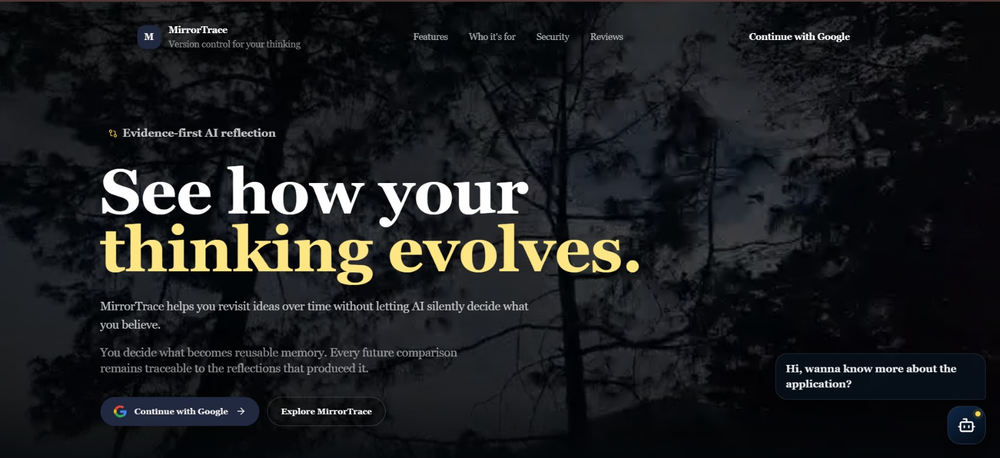

The public MirrorTrace experience introduces the application as **evidence-first AI reflection**.

Users can explore the product before authentication and then continue securely using Google Sign-In.

The landing experience communicates three fundamental ideas:

- private reflection should remain private
- AI memory should require explicit consent
- future comparisons should remain traceable to evidence

TraceBot is also available publicly to explain product features, navigation, and privacy boundaries before a user signs in.

---

## 👥 Who MirrorTrace Is For

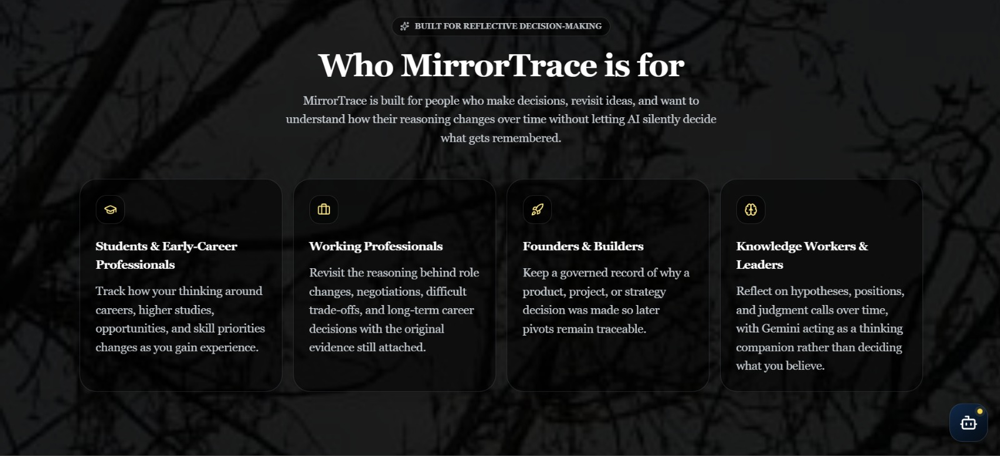

MirrorTrace is designed for people who make decisions, revisit ideas, and want to understand how their reasoning changes over time.

### 🎓 Students & Early-Career Professionals

MirrorTrace can help track changing reasoning around:

- careers
- internships
- higher studies
- examinations
- projects
- opportunities
- skill priorities

Example:

```text
Earlier:
I think pursuing an MBA immediately after graduation
is the best next step.

Later:
I may benefit more from gaining technical or consulting
experience before pursuing an MBA.
```

MirrorTrace can preserve both positions and later compare what changed.

### 💼 Working Professionals

Useful for:

- role changes
- negotiations
- difficult trade-offs
- retrospectives
- career planning
- mentoring
- long-term decisions

### 🛠️ Founders & Builders

Useful for preserving reasoning behind:

- product decisions
- architecture choices
- assumptions
- prioritization
- pivots
- risk decisions
- user hypotheses

### 🧠 Knowledge Workers & Leaders

Useful for:

- strategic reflection
- hypothesis tracking
- decision calibration
- assumption review
- structured peer reasoning

---

## 🧭 Product Navigation

| Page | Purpose |
|---|---|
| **Overview** | Reflection metrics, perspective evolution, and quick actions |
| **Reflect & Chat** | Private journaling and Gemini-assisted reflection |
| **Journal History** | Search, filter, revisit, edit, and analyze saved reflections |
| **Memory** | Approved AI memory, Thought Diffs, provenance, retention, and watches |
| **Support** | Privacy-aware customer support |
| **Feedback** | Product feedback and consent-controlled public reviews |
| **MirrorRoom** | Temporary selective collaborative reasoning |
| **Admin Control Room** | Authorized operational administration |
| **TraceBot** | Public application and privacy guide |

---

## 🏠 User Overview

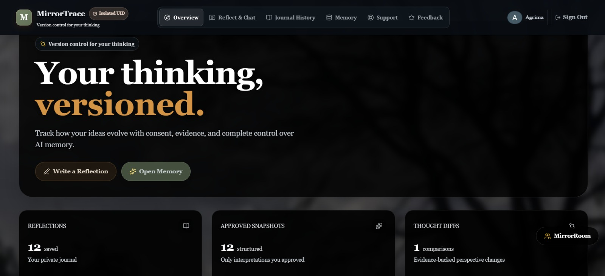

The authenticated Overview acts as the user's reflective command center.

It surfaces:

- saved reflections
- approved Thought Snapshots
- Thought Diff count
- perspective-evolution state
- navigation into Memory Governance
- direct access to reflection workflows
- MirrorRoom access

The goal is to make the user's reflective history visible without turning the product into a social feed.

---

## ⚡ Quick Actions

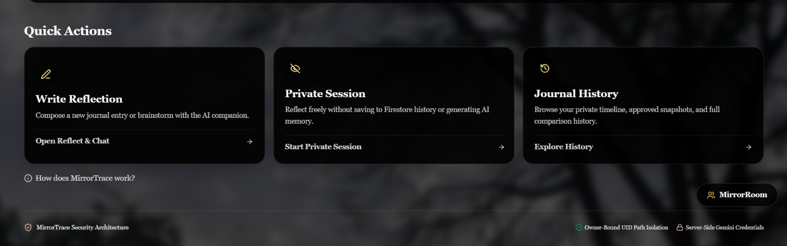

The Overview provides direct entry points into the application's most common workflows.

```text
Write Reflection
Private Session
Journal History
```

### ✍️ Write Reflection

Opens the primary Reflect & Chat workspace.

### 🔒 Private Session

Allows users to think freely without automatically creating persistent journal history or reusable AI memory.

### 📚 Journal History

Opens the user's owner-isolated reflection timeline and longitudinal analysis tools.

---

## ✍️ Reflective Space

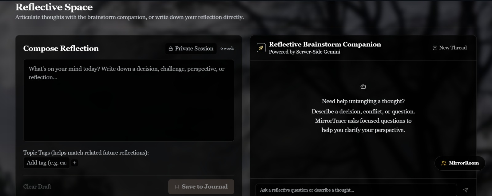

The Reflective Space combines two complementary workflows:

```text
Compose Reflection
        +
Reflective Brainstorm Companion
```

### 📝 Compose Reflection

Users can:

- write naturally
- add topic tags
- save reflections privately
- later generate Thought Snapshot proposals

### 🤖 Reflective Brainstorm Companion

MirrorTrace uses Gemini as a multi-turn reflective thinking companion.

The conversation can explore:

- decisions
- uncertainty
- assumptions
- conflict
- alternatives
- trade-offs
- evidence
- perspective clarification

Example:

```text
User:
I currently think technology consulting may suit me
after graduation.

Gemini:
What makes technology consulting more attractive than
your other options right now?

User:
It combines technology, strategy, problem solving,
and client-facing work.

Gemini:
Which of those assumptions could you test before
committing to that path?
```

The assistant helps the user reason.

It does not silently decide what the user believes.

---

## 🧠 Thought Snapshots

A saved reflection can be transformed into a structured **Thought Snapshot proposal**.

A proposal can contain:

```text
Position Statement
Topic
Tags
Retention Preference
Source Journal
```

The user receives three explicit choices:

```text
Accept
Edit & Accept
Reject
```

### ✅ Accept

The proposed interpretation becomes approved reusable memory.

### ✏️ Edit & Accept

The user can correct the AI interpretation before allowing it to become reusable memory.

### ❌ Reject

The interpretation is discarded.

It does not become approved reusable memory.

> **AI may propose memory. The user authorizes memory.**

---

## 🔐 Consent-Governed AI Memory

MirrorTrace deliberately separates different classes of reflective data.

```text
Private Journal Entry

Gemini Conversation

Temporary AI Interpretation

Approved Thought Snapshot

Thought Diff

Perspective Watch
```

These are not treated as interchangeable objects.

A generated interpretation does not receive persistent authority simply because Gemini produced it.

The user remains the governing authority.

---

## 🔄 Thought Diffs

Thought Diffs compare **related approved Thought Snapshots** from different points in time.

A Thought Diff can capture:

- earlier position
- later position
- apparent change
- apparent continuity
- relationship assessment
- supporting evidence
- provenance

The system does not compare snapshots blindly.

Candidate memories must first be sufficiently related for comparison.

Conceptually:

```text
Earlier Position
        |
        v
Later Position
        |
        v
What Changed?
        +
What Stayed Consistent?
        +
Supporting Evidence
```

> **Thought Diffs act like version control for human thinking.**

---

## 🔎 Provenance

Every meaningful AI-generated comparison should be inspectable.

MirrorTrace connects Thought Diffs back to their source evidence.

```text
Thought Diff
     |
     +---- Earlier Thought Snapshot
     |           |
     |           +---- Earlier Journal Entry
     |
     +---- Later Thought Snapshot
                 |
                 +---- Later Journal Entry
```

Provenance can preserve:

- source snapshot IDs
- source journal IDs
- timestamps
- excerpts
- source positions
- relationship evidence

Controls such as:

```text
Why am I seeing this?

Inspect Provenance
```

allow users to understand why a perspective comparison was generated.

---

## 📚 Journal History

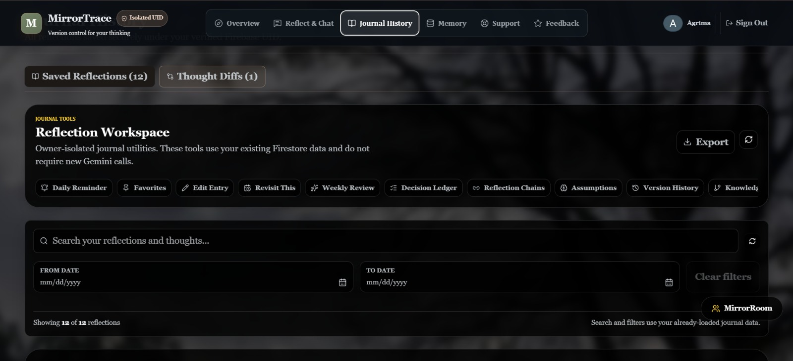

Journal History turns saved reflections into a structured personal reasoning record.

Users can browse their history using:

- text search
- topic filters
- date filters
- list view
- calendar view
- approved-memory filtering

The Reflection Workspace also includes:

```text
Daily Reminder
Favorites
Edit Entry
Revisit This
Weekly Review
Decision Ledger
Reflection Chains
Assumptions
Version History
Knowledge Graph
Export
```

These tools operate over the user's own reflective history.

---

## 📊 Year in Reflection

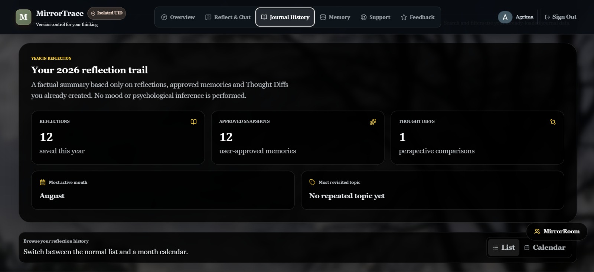

Year in Reflection creates a factual summary from the user's existing reflective record.

It can surface:

- reflection count
- approved memories
- Thought Diffs
- most active periods
- revisited topics

The feature deliberately avoids psychological diagnosis or unsupported emotional inference.

> **It summarizes evidence already present in the user's data.**

---

## 🛡️ Memory Governance Center

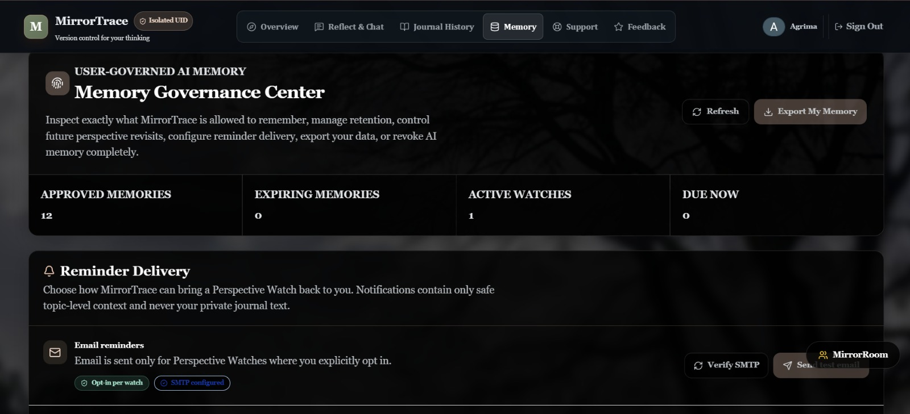

Memory Governance is the user's control plane for reusable AI memory.

Users can inspect and manage:

- approved Thought Snapshots
- retention
- expiring memories
- Thought Diffs
- provenance
- Perspective Watches
- reminder delivery
- memory export
- memory revocation

The interface exposes high-level governance state such as:

```text
Approved Memories
Expiring Memories
Active Watches
Due Now
```

> **The user should always be able to see what MirrorTrace is allowed to remember.**

---

## 👁️ Perspective Watch

Perspective Watch allows users to intentionally revisit a position in the future.

Instead of AI silently deciding which belief should be monitored, the user controls:

```text
What should be revisited?

When should it be revisited?

Should reminders be enabled?
```

This keeps future reflection user-directed.

---

## 👥 MirrorRoom

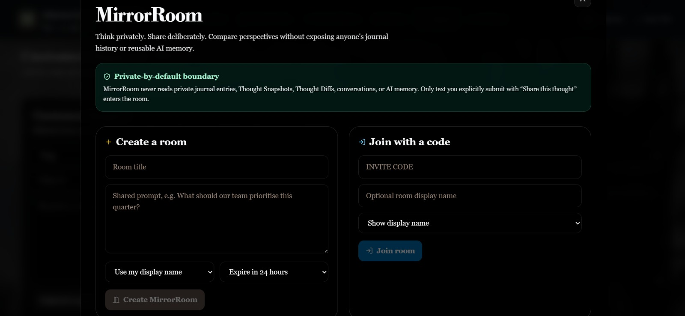

> **Think privately. Share deliberately.**

MirrorRoom is a temporary collaborative reasoning environment.

It is intentionally **not a shared journal**.

Users can:

- create temporary rooms
- define a shared prompt
- generate invite codes
- join using invite codes
- choose display-name behaviour
- view participants
- explicitly share contributions
- generate factual room summaries
- save only their own takeaway
- close rooms
- use automatic expiry

### 🔒 MirrorRoom Privacy Boundary

Joining a room does not automatically expose:

```text
Private Journal History
Thought Snapshots
Thought Diffs
Provenance
Private Gemini Conversations
Reusable AI Memory
Private Takeaways
```

The collaboration model is:

```text
Private Thought
      |
      v
Explicit "Share this thought"
      |
      v
MirrorRoom Contribution
```

not:

```text
Private Account History
      |
      v
Automatic Room Exposure
```

Server-side membership validation protects room access.

---

## 🗂️ Data Separation

Private user data and collaborative MirrorRoom data use separate logical namespaces.

```text
Private User Namespace

users/{uid}/journals
users/{uid}/conversations
users/{uid}/thoughtSnapshots
users/{uid}/thoughtDiffs
users/{uid}/provenance
users/{uid}/perspectiveWatches


Collaborative Namespace

reflectionRooms/{roomId}
```

This keeps privacy boundaries visible in the data architecture itself.

---

## 🧑‍💻 Admin Control Room

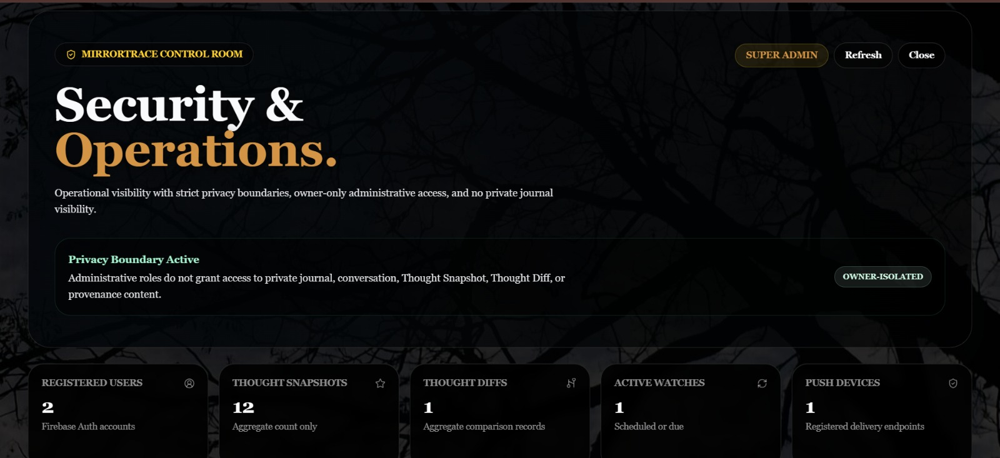

The Admin Control Room provides operational administration for authorized administrators.

It exposes:

- platform KPIs
- registered-user counts
- Thought Snapshot counts
- Thought Diff counts
- active watches
- push-device counts
- support workflows
- review moderation
- operational metadata
- MirrorRoom metadata

The admin experience follows a strict principle:

> **Operational visibility should not automatically mean private journal visibility.**

---

## 🩺 Service Health & Aggregate Activity

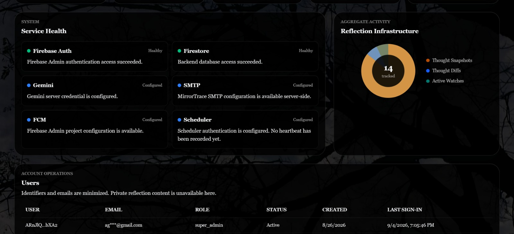

The Admin Control Room can surface service-health indicators for:

- Firebase Authentication
- Cloud Firestore
- Gemini
- SMTP
- Firebase Cloud Messaging
- scheduler configuration

It also exposes aggregate reflective infrastructure such as:

- Thought Snapshot count
- Thought Diff count
- active Perspective Watches

The operations layer can inspect service state without requiring unrestricted access to private journal bodies.

---

## 🔐 Admin Privacy Boundary

Administrative workflows can use metadata such as:

```text
User ID
Masked Email
Role
Account Status
Creation Time
Last Sign-In
Aggregate Counts
System Health
Room Metadata
```

without treating private reflective content as routine administrative data.

MirrorRoom administration is also intended to remain metadata-oriented.

Operational analytics should not automatically expose:

- room contribution text
- private journal content
- reusable AI memory
- private Gemini conversations
- private takeaways

---

## 🆘 Support

The Support workflow lets users intentionally submit the information they want administrators to receive.

Private journal history is not automatically attached to a support ticket.

This prevents support workflows from becoming an indirect mechanism for exposing private reflection history.

---

## ⭐ Feedback & Public Reviews

MirrorTrace includes a consent-controlled feedback and public-review workflow.

```text
User Feedback
      |
      v
Explicit Public-Display Consent
      |
      v
Moderation
      |
      v
Admin Approval
      |
      v
Public Review
```

Private feedback therefore does not automatically become public content.

---

## 🤖 TraceBot

TraceBot is the public MirrorTrace application guide.

It can explain:

- what MirrorTrace does
- navigation
- Thought Snapshots
- Thought Diffs
- provenance
- Memory Governance
- Perspective Watch
- MirrorRoom
- Support
- Feedback
- privacy boundaries

TraceBot is intentionally separate from the authenticated **Reflective Brainstorm Companion**.

| Assistant | Purpose |
|---|---|
| **TraceBot** | Explain MirrorTrace and its privacy model |
| **Reflective Brainstorm Companion** | Help an authenticated user reason through a thought |

---

## 🔐 Security Architecture

MirrorTrace is designed around explicit trust boundaries.

### 🔑 Firebase Authentication

Firebase Authentication provides authenticated user identity and Google Sign-In.

### 🛡️ Server-Side Identity Verification

Protected API requests verify Firebase identity server-side using the Firebase Admin SDK.

The backend does not trust a UID simply because the browser supplied it.

### 👤 Owner-Bound Firestore Isolation

Private reflective data is bound to verified user identity.

```text
Authenticated Firebase User
            |
            v
Verified UID
            |
            v
users/{uid}/...
```

### 🤖 Server-Side Gemini Credentials

Gemini calls are performed through the backend rather than exposing private Gemini credentials through browser application logic.

### 🔒 Firestore Rules

Firestore rules provide an additional ownership boundary around user-scoped data.

### 🧑‍💻 Admin Authorization

Displaying an Admin button is not treated as authorization.

Backend authorization remains authoritative.

### 👥 MirrorRoom Membership

MirrorRoom membership is validated server-side.

Knowing a room ID alone should not grant unrestricted access.

---

## 🏗️ Architecture

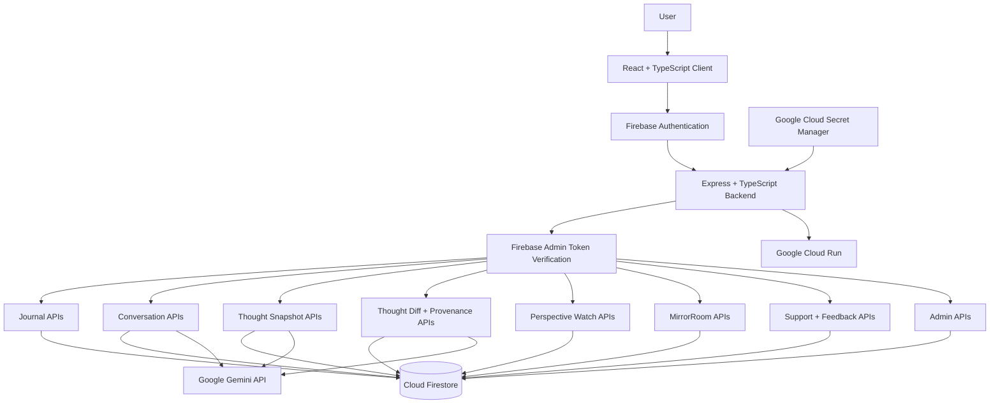

---

## 🔄 Reflection Lifecycle

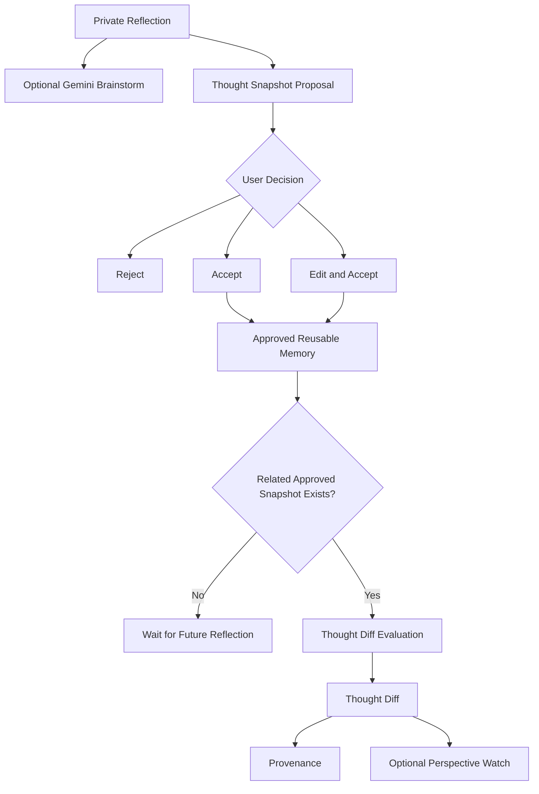

---

## 👥 MirrorRoom Lifecycle

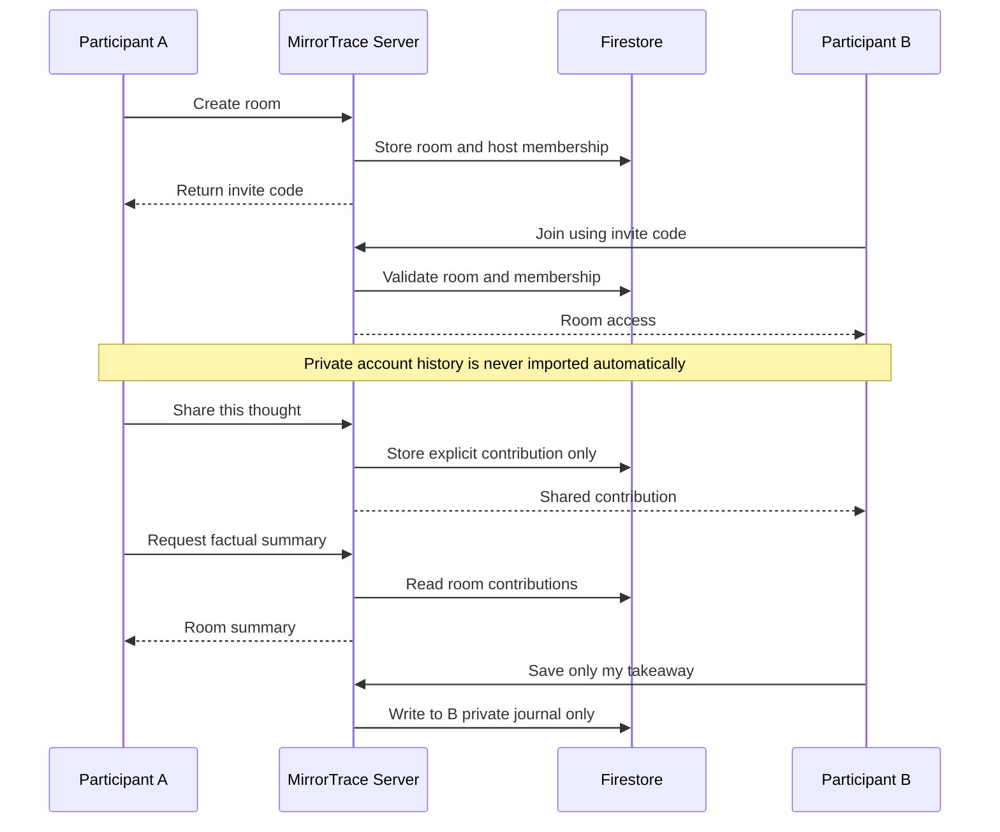

---

## ☁️ Google Cloud & Gemini Usage

| Service | MirrorTrace Usage |
|---|---|
| **Firebase Authentication** | Google Sign-In and authenticated user identity |
| **Cloud Firestore** | Journals, conversations, approved memories, Thought Diffs, provenance, watches, rooms, support, and feedback |
| **Google Gemini API** | Multi-turn reflection, Thought Snapshot proposals, and Thought Diff evaluation |
| **Firebase Admin SDK** | Server-side identity verification and privileged backend operations |
| **Google Cloud Secret Manager** | Secure production Gemini credential handling |
| **Google Cloud Run** | Production full-stack deployment |

---

## ⚙️ Key Engineering Decisions

| Challenge | MirrorTrace Approach |
|---|---|
| AI should not silently define user memory | Explicit Thought Snapshot approval |
| AI interpretation may be incorrect | Edit & Accept |
| Rejected interpretations should not persist | Reject produces no approved memory |
| Perspective comparisons require evidence | Thought Diff provenance |
| Private journals must remain isolated | UID-scoped Firestore architecture |
| Collaboration should not expose history | Separate MirrorRoom namespace |
| Room IDs should not equal authorization | Server-side membership validation |
| Admin UI should not equal authority | Server-side admin authorization |
| Gemini credentials should not reach browser code | Server-side Gemini integration |
| Invalid API routes should not return SPA HTML | Explicit `/api` JSON 404 |
| Production behaviour should be testable | Build, predeploy, and smoke tests |

---

## 🛠️ Tech Stack

| Layer | Technology |
|---|---|
| Frontend | React |
| Language | TypeScript |
| Build | Vite |
| Styling | Tailwind utilities + MirrorTrace custom CSS |
| Backend | Express + TypeScript |
| Authentication | Firebase Authentication |
| Database | Cloud Firestore |
| Server Authentication | Firebase Admin SDK |
| Generative AI | Google Gemini |
| Deployment | Google Cloud Run |
| Secret Management | Google Cloud Secret Manager |
| Icons | Lucide React |

---

## 📡 API Surface

### Health

```text
GET /api/health
```

### Journal

```text
POST   /api/journal
GET    /api/journal
DELETE /api/journal/:id
```

### Conversations

```text
POST /api/conversations
GET  /api/conversations
GET  /api/conversations/:id/messages
POST /api/conversations/:id/messages
```

### Thought Snapshots

```text
POST   /api/thought-snapshots/propose
POST   /api/thought-snapshots/approve
GET    /api/thought-snapshots
DELETE /api/thought-snapshots/:id
```

### Thought Diffs

```text
POST /api/thought-diffs/generate
GET  /api/thought-diffs
GET  /api/thought-diffs/:id/provenance
POST /api/thought-diffs/:id/feedback
```

### Perspective Watch

```text
POST  /api/perspective-watches
GET   /api/perspective-watches
PATCH /api/perspective-watches/:id
```

### Memory

```text
GET /api/memory/export
```

### MirrorRoom

```text
GET /api/mirror-rooms/ping
```

Unknown `/api/*` routes return a JSON `404` rather than falling through to the React SPA.

---

## 📁 Repository Structure

```text
Gen-AI-APAC-Ideathon/
│
├── docs/
│   └── images/
│       ├── admin-dashboard.jpeg
│       ├── admin-service-health.jpeg
│       ├── journal-history.jpeg
│       ├── memory-governance.jpeg
│       ├── mirrorroom.jpeg
│       ├── quick-actions.jpeg
│       ├── reflective-space.jpeg
│       ├── sign-in-page.jpeg
│       ├── target-audience.jpeg
│       ├── user-overview.jpeg
│       └── year-in-reflection.jpeg
│
├── public/
│
├── server/
│   ├── adminRoutes.ts
│   ├── emailRoutes.ts
│   ├── firebaseAdmin.ts
│   ├── gemini.ts
│   ├── journalEnhancementRoutes.ts
│   ├── notificationRoutes.ts
│   ├── reflectionRoomRoutes.ts
│   ├── runtimeConfig.ts
│   ├── securityMiddleware.ts
│   └── supportReviewRoutes.ts
│
├── src/
│   ├── components/
│   ├── hooks/
│   ├── lib/
│   ├── styles/
│   │   ├── mirrortrace-app.css
│   │   └── mirrortrace-public.css
│   ├── App.tsx
│   └── main.tsx
│
├── scripts/
│   ├── predeployCheck.ts
│   ├── productionVerify.ts
│   ├── releaseGate.ps1
│   ├── setAdminRole.ts
│   └── smokeTest.ts
│
├── firestore.rules
├── server.ts
├── vite.config.ts
├── package.json
└── README.md
```

---

## ⚙️ Running Locally

### Requirements

```text
Node.js
npm
Firebase project configuration
Gemini API credential
```

### 1. Clone the Repository

```bash
git clone https://github.com/agcodes0315/Gen-AI-APAC-Ideathon.git
cd Gen-AI-APAC-Ideathon
```

### 2. Install Dependencies

```bash
npm install
```

### 3. Configure Environment

Configure the Firebase and backend environment values required by the project.

Never commit:

```text
.env
service-account JSON files
private credentials
Gemini API keys
```

### 4. Start MirrorTrace

```bash
npm run dev
```

Open:

```text
http://localhost:3000
```

---

## 🧪 Production Verification

### TypeScript Check

```bash
npm run lint
```

### Production Build

```bash
npm run build
```

### Pre-Deployment Verification

```bash
npx tsx ./scripts/predeployCheck.ts
```

### Smoke Test

With MirrorTrace running:

```bash
npx tsx ./scripts/smokeTest.ts
```

The smoke test validates:

```text
GET /api/health
Landing Page
Favicon
Anonymous Admin Protection
Unknown API JSON 404 Behaviour
```

Current local verification:

| Check | Status |
|---|---|
| `npm run lint` | ✅ PASS |
| `npm run build` | ✅ PASS |
| `predeployCheck.ts` | ✅ PASS |
| `smokeTest.ts` | ✅ PASS |

---

## 🔐 Production Secret Management

Gemini credentials must remain server-side.

Example Google Cloud Secret Manager setup:

```bash
gcloud secrets create GEMINI_API_KEY \
  --replication-policy="automatic"
```

Add the secret:

```bash
echo -n "YOUR_API_KEY" | \
gcloud secrets versions add GEMINI_API_KEY \
  --data-file=-
```

Grant the Cloud Run runtime service account access:

```bash
gcloud secrets add-iam-policy-binding GEMINI_API_KEY \
  --member="serviceAccount:YOUR_RUNTIME_SERVICE_ACCOUNT" \
  --role="roles/secretmanager.secretAccessor"
```

The secret value should never be exposed through frontend code or committed to Git.

---

## ☁️ Cloud Run Deployment

MirrorTrace is designed for deployment on Google Cloud Run.

The backend supports Cloud Run's runtime `PORT` configuration and listens on:

```text
0.0.0.0
```

Apply the required challenge label after deployment:

```bash
gcloud run services update YOUR_SERVICE_NAME \
  --region=YOUR_REGION \
  --update-labels=dev-tutorial=cloud-run-ai-challenge
```

Verify:

```bash
gcloud run services describe YOUR_SERVICE_NAME \
  --region=YOUR_REGION \
  --format="value(metadata.labels)"
```

---

## 🌐 Live Demo

```text
Google Cloud Run URL:
ADD AFTER FINAL PRODUCTION DEPLOYMENT
```

---

## ✅ Submission Readiness

### Functional

- [x] Private journaling
- [x] Multi-turn Gemini conversation
- [x] Thought Snapshot proposals
- [x] Accept / Edit / Reject consent
- [x] Approved reusable AI memory
- [x] Thought Diffs
- [x] Provenance
- [x] Perspective Watch
- [x] Journal History
- [x] Memory Governance
- [x] MirrorRoom
- [x] Admin Control Room
- [x] Support
- [x] Feedback
- [x] TraceBot

### Local Stability

- [x] TypeScript check
- [x] Production build
- [x] Pre-deployment check
- [x] Smoke test
- [x] Unknown API JSON 404
- [x] Anonymous Admin rejection

### Production

- [ ] Cloud Run deployment
- [ ] Production Google Sign-In test
- [ ] Production Gemini test
- [ ] Firestore persistence test
- [ ] Two-account owner-isolation test
- [ ] Production MirrorRoom test
- [ ] Admin authorization test
- [ ] Secret Manager verification
- [ ] Required Cloud Run challenge label verification

---

## 🎯 What Makes MirrorTrace Different

### 🧠 Consent Is Part of the Memory Architecture

AI-generated interpretations do not silently become reusable memory.

### 🔄 Perspective Change Is a First-Class Object

MirrorTrace does not simply archive entries.

It models relationships between approved positions over time.

### 🔎 AI Comparisons Are Evidence-Backed

Thought Diffs retain provenance back to approved source evidence.

### ✏️ Users Can Correct AI Memory

`Edit & Accept` allows users to correct an AI interpretation before persistence.

### ❌ Rejection Actually Means Rejection

A rejected Thought Snapshot does not become approved reusable memory.

### 👥 Collaboration Is Selective

MirrorRoom does not require users to surrender private journal history.

### 🛡️ Administration Is Privacy-Bounded

Operational visibility does not automatically imply unrestricted private-content visibility.

### 👤 The User Remains the Authority

Users can:

```text
Accept
Edit
Reject
Inspect
Retain
Export
Revoke
Share
Withhold
```

---

## 🧭 Design Philosophy

MirrorTrace prioritizes:

```text
Consent
   over
Automatic Memory


Provenance
   over
Unsupported Inference


Private Ownership
   over
Default Sharing


Selective Collaboration
   over
Shared History


User Correction
   over
AI Authority
```

> **AI should help people examine their thinking without quietly taking ownership of their history.**

---

## 📊 What This Project Demonstrates

MirrorTrace brings together:

- full-stack TypeScript engineering
- React application architecture
- Firebase Authentication
- Firebase Admin authentication verification
- Cloud Firestore data modeling
- Firestore owner isolation
- Gemini integration
- multi-turn AI conversation
- consent-aware AI memory
- explainable provenance
- longitudinal reasoning
- privacy boundaries
- selective collaboration
- server-side authorization
- operational administration
- Google Cloud Run deployment readiness
- production verification

---

## 🌱 Production Roadmap

```text
Phase 1 — Current Submission
├── Private Reflection
├── Multi-turn Gemini
├── Consent-Governed Memory
├── Thought Snapshots
├── Thought Diffs
├── Provenance
├── Memory Governance
├── Perspective Watch
├── MirrorRoom
└── Admin Control Room

Phase 2 — Memory Intelligence
├── Richer semantic retrieval
├── Cross-topic reasoning
├── Advanced retention policies
└── Improved longitudinal discovery

Phase 3 — Organization Workflows
├── Organization-level RBAC
├── Governed collaborative workspaces
├── Richer audit telemetry
└── Expanded moderation

Phase 4 — Production Scale
├── Cloud Scheduler / Tasks
├── Structured observability
├── Accessibility audits
└── Advanced export and portability
```

---

## ⚠️ Scope

MirrorTrace is a reflective-intelligence application.

It is not a:

```text
Medical System
Psychological Diagnostic System
Clinical Decision System
Therapeutic System
```

Its purpose is to help users articulate, revisit, and compare their own reasoning while keeping them in control of reusable AI memory.

---

## 👩‍💻 Author

### Agrima Saxena

**Solo Developer · Full-Stack Engineering · AI/ML · Cloud · Security**

<table>
<tr>

<td width="60">
<a href="https://www.linkedin.com/in/agrima-saxena-142960426/" title="LinkedIn">

</a>
</td>

<td width="60">
<a href="mailto:agrimalc@gmail.com" title="Email">

</a>
</td>

<td width="60">
<a href="https://github.com/agcodes0315" title="GitHub">

</a>
</td>

</tr>
</table>

<a href="https://github.com/agcodes0315/Gen-AI-APAC-Ideathon">

</a>

<a href="https://github.com/agcodes0315/Gen-AI-APAC-Ideathon">

</a>

*Built independently as a solo project for the Google Cloud Gen AI Academy — APAC Edition / Cloud Run Build & Deploy Social Challenge.*

⭐ **If you found the project useful or interesting, consider starring the repository.**

---

### 🔗 MirrorTrace is not trying to remember everything.

**It is trying to remember only what the user deliberately permits.**

**Private reflection · Consent-governed memory · Evidence-backed change · Selective collaboration**