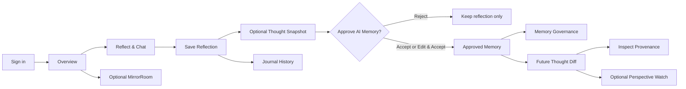
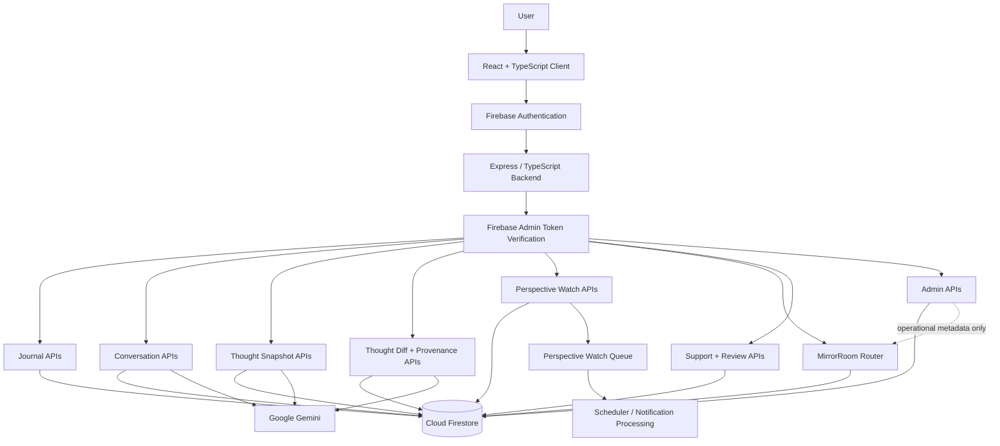
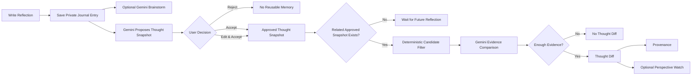
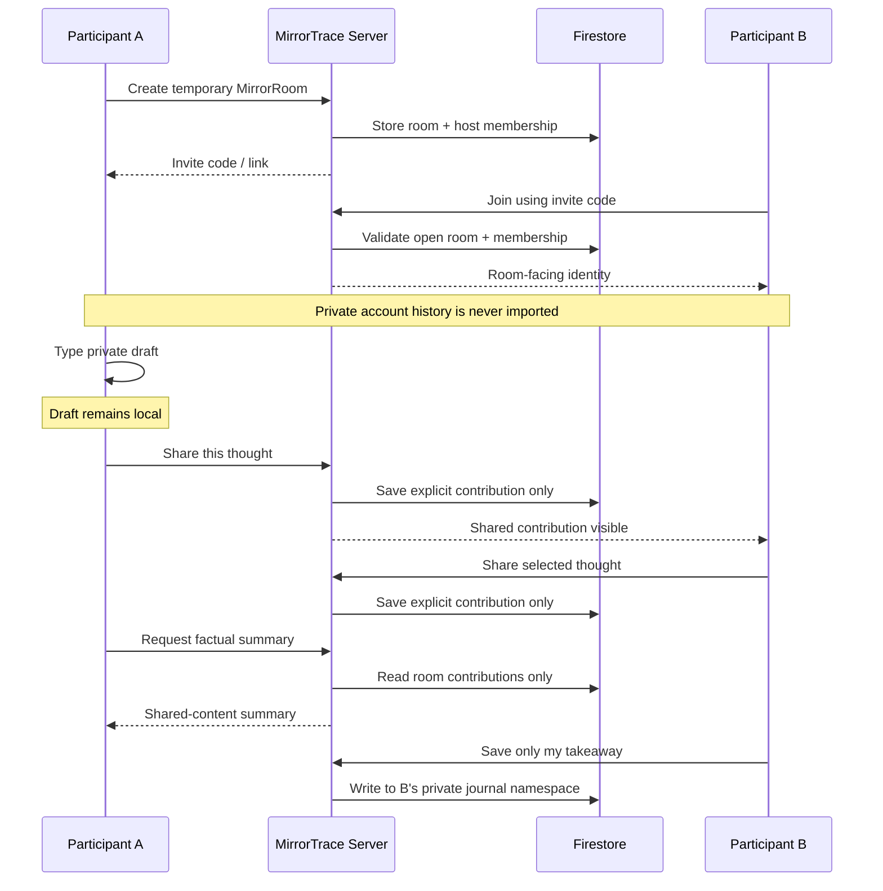

<div align="center">

# MirrorTrace

### Privacy-First AI Reflection, Memory Governance & Collaborative Reasoning

**Think privately. Remember deliberately. Compare perspectives with evidence. Share only what you choose.**

Built with **Gemini · Firebase Authentication · Firestore · React · TypeScript · Express · Vite**

</div>

---

## Overview

MirrorTrace is a privacy-first reflective intelligence platform designed to help people capture thoughts, reason through decisions, revisit earlier perspectives, and understand how their thinking changes over time.

Most AI journaling products optimize for conversation. MirrorTrace focuses on something harder:

> **How can AI help a person build useful long-term reflective memory without silently turning every private thought into permanent AI context?**

MirrorTrace answers that with a consent-governed architecture.

A reflection can remain only a journal entry. Gemini may propose a structured interpretation called a **Thought Snapshot**, but that interpretation is not reusable memory until the user explicitly accepts it. Related approved snapshots can later produce **Thought Diffs** showing what changed, what remained consistent, and exactly which source reflections were used.

MirrorTrace also includes **MirrorRoom**, a temporary collaborative reasoning mode where participants think privately first and share selected thoughts deliberately. Joining a room never exposes a participant's private journal, AI memory, Thought Snapshots, Thought Diffs, provenance, or conversation history.

---

# The Problem

Digital journaling and AI assistants are increasingly good at remembering information, but memory creates a new set of problems.

### 1. AI memory can become invisible

Users often cannot tell what the AI has remembered, which interpretation became persistent, how long it will be retained, where a later conclusion came from, or whether an AI-generated inference was ever explicitly approved.

### 2. Reflections lose their history

A journal stores entries, but does not naturally answer:

- *What did I think about this six months ago?*
- *Did my position actually change?*
- *What stayed consistent?*
- *What evidence supports the AI's comparison?*

### 3. Collaborative thinking usually destroys privacy boundaries

Shared documents and social collaboration systems often assume that participants should share a common information space. That is inappropriate for reflective data.

People may want to compare perspectives without exposing private journals, personal AI conversations, reusable memory, historical beliefs, or unrelated sensitive reflections.

### 4. Administration can become surveillance

Operational teams need enough information to support and moderate a platform, but they should not automatically become readers of private reflective content.

MirrorTrace separates **operational visibility** from **content visibility**.

---

# The Core Idea

MirrorTrace treats reflective AI as a **consent-and-provenance problem**, not only a generation problem.

The product follows four principles:

1. **Private by default** — reflections belong to one authenticated user.
2. **AI interpretation requires consent** — reusable Thought Snapshots are approved by the user.
3. **Longitudinal claims require evidence** — Thought Diffs are linked to their source reflections through provenance.
4. **Collaboration is selective** — MirrorRoom receives only content participants deliberately share.

---

# Who MirrorTrace Is For

## Students & Early-Career Professionals

MirrorTrace helps students preserve the reasoning behind choices involving internships, projects, higher education, career paths, exam preparation, and skill development.

**Why it matters:** priorities change quickly, and MirrorTrace makes that evolution visible without turning every temporary thought into permanent AI memory.

## Working Professionals

Professionals can use MirrorTrace for role-change decisions, career planning, mentoring, difficult trade-offs, retrospectives, and pre-meeting reflection.

**Why it matters:** it creates a traceable record of how a position evolved instead of producing one-off advice.

## Founders, Builders & Product Teams

Founders and builders constantly revise assumptions about users, product direction, architecture, go-to-market, priorities, and risk.

**Why it matters:** independent reasoning can be preserved before group discussion, then compared later.

## Knowledge Workers & Leaders

MirrorTrace supports decision calibration, strategic reflection, leadership retrospectives, assumption tracking, and structured peer discussion.

**Why it matters:** MirrorRoom lets people think independently before seeing what others chose to share.

---

# Product Experience

## Public Landing Page

The signed-out experience explains the reflection workflow, consent-governed memory, Thought Snapshots, Thought Diffs, security boundaries, target audiences, and public reviews.

Google Sign-In provides the authenticated entry point.

```md

```

---

# Authenticated Navigation

| Navbar Item | Purpose |
| --- | --- |
| **Overview** | Personal reflection dashboard and entry point into reflective history. |
| **Reflect & Chat** | Write a reflection, save it privately, and optionally continue with the Gemini reflective companion. |
| **Journal History** | Search, filter, revisit, organize, compare, and review saved reflections. |
| **Memory** | Inspect approved reusable memory, Thought Diffs, provenance, Perspective Watches, retention, export, and revocation controls. |
| **Support** | Submit support requests without giving administrators unrestricted access to journal content. |
| **Feedback** | Submit product reviews with explicit public-display consent. |

MirrorRoom and Admin Control Room are separate floating actions rather than ordinary navbar pages.

---

# Overview

The Overview page gives the user a concise view of MirrorTrace activity and provides shortcuts into reflection and memory workflows.

```md

```

---

# Reflect & Chat

## Compose Reflection

The user writes a private reflection and may add topic tags. Saving creates an owner-bound journal entry.

## Reflective Brainstorm

The Gemini-powered companion helps the user articulate thoughts, clarify decisions, explore uncertainty, examine trade-offs, and continue a multi-turn reflective conversation.

Conversation creation is independent of Gemini generation so an AI failure does not prevent the application from preserving the user's core journal data.

## Private Session

Private Session is intended for temporary reflection that should not become persistent journal, conversation, Thought Snapshot, Thought Diff, or Perspective Watch data.

```md

```

---

# Thought Snapshots — Consent-Governed AI Memory

After a saved reflection, Gemini can propose a structured interpretation called a **Thought Snapshot**.

A proposal can include a concise position statement, topic, and tags.

The proposal is **non-persistent** until the user explicitly approves it.

The user can:

- **Accept**
- **Edit & Accept**
- **Reject**

Approved memories support retention controls such as:

- until removed;
- 30 days;
- 180 days;
- 365 days.

This turns AI memory from an invisible behavior into an explicit user decision.

---

# Thought Diffs

Thought Diffs compare related approved Thought Snapshots from different source reflections.

MirrorTrace first performs deterministic candidate filtering using topic similarity and tag overlap. Gemini then evaluates whether enough evidence exists for a meaningful comparison.

A Thought Diff can show:

- Earlier Position
- Current Position
- What Changed
- What Stayed Consistent
- Relationship Assessment

MirrorTrace prevents same-journal self-comparisons, resolves canonical chronology, avoids duplicate pairs, and cleans invalid or reversed comparisons.

---

# Provenance — “Why am I seeing this?”

Every valid Thought Diff can be linked to a provenance record containing safe user-visible evidence such as source identifiers, dates, excerpts, and earlier/later position statements.

This lets the user inspect the evidence behind an AI-generated longitudinal comparison.

---

# Perspective Watch

A user can explicitly choose to revisit a Thought Diff later.

Supported revisit periods include 7, 30, and 90 days.

Perspective Watch is deliberately **user initiated**. MirrorTrace does not autonomously decide that a belief should be monitored.

Reminder messages can use topic-level context without exposing raw journal text.

---

# Journal History

Journal History turns saved reflections into an inspectable personal record.

The implemented experience includes:

- journal search and filtering;
- calendar/list browsing;
- favorites and pinning;
- draft support;
- editing;
- Revisit This;
- Weekly Review;
- Year in Reflection;
- Decision Ledger;
- Reflection Chains;
- Assumption Tracker;
- Version History;
- Knowledge Graph;
- export;
- reminder-oriented workflows.

```md

```

---

# Memory Governance

The Memory page is the user's control plane for reusable reflective intelligence.

Users can inspect approved Thought Snapshots, retention state, Thought Diffs, provenance, and Perspective Watches.

Users can also export governed MirrorTrace memory and revoke approved reusable memory.

```md

```

---

# MirrorRoom — Consent-Based Collaborative Reflection

> **Think privately. Share deliberately. Compare perspectives without surrendering your personal history.**

MirrorRoom is a temporary collaborative reasoning mode.

It is intentionally **not a collaborative journal**.

## MirrorRoom Capabilities

- create a temporary room;
- random invite code;
- copyable invite link;
- join by invite code;
- named or anonymous participation;
- room prompt;
- explicit **Share this thought** action;
- participant list;
- shared contribution board;
- factual room summary;
- **Save only my takeaway**;
- host-only closing;
- room expiration;
- server-side membership enforcement.

## MirrorRoom Privacy Boundary

Joining a room does **not** expose journal history, Thought Snapshots, Thought Diffs, provenance, Gemini conversations, reusable AI memory, or saved private takeaways.

Text typed locally remains private until **Share this thought** is pressed.

Only deliberately shared room contributions are visible to participants.

A personal takeaway is written only into the signed-in user's private journal.

## Identity Controls

MirrorRoom supports room-facing identity through a chosen display name or anonymous participation.

The private Firebase UID is not intended to act as the user's public room identity.

## Factual Summary

The current MirrorRoom summary is grounded only in explicitly shared room content and can operate independently of Gemini.

```md

```

---

# Support

The Support page allows users to explicitly submit a support ticket.

Administrators receive the support text that the user intentionally submitted — not unrestricted access to journal history.

```md

```

---

# Feedback & Public Reviews

Users can submit product feedback and reviews.

Public display is consent based, so a review can remain pending until moderation and should only become public when approval and public-consent requirements are satisfied.

---

# Admin Control Room

The Admin Control Room includes:

- KPI cards;
- Service Health;
- reflection infrastructure visualization;
- Users table;
- Support Queue;
- Review Moderation;
- Admin Audit Log;
- MirrorRoom operational analytics.

## Admin Privacy Boundary

MirrorRoom analytics can expose operational metadata such as totals, active/closed status, masked identities, participant roles, created timestamps, and expiry timestamps.

The admin endpoint is designed not to expose room prompt, contribution text, factual summary text, takeaway text, journals, conversations, Thought Snapshots, Thought Diffs, provenance, reusable AI memory, or invite codes.

```md

```

---


# How to Navigate MirrorTrace

MirrorTrace is organized around a simple progression: **capture a thought, reflect on it, decide what AI may remember, revisit how your thinking changes, and share only when you choose.**

## Navigation at a Glance

| Page / Control | What it does | When to use it |
| --- | --- | --- |
| **Overview** | Shows your personal MirrorTrace activity and gives you a quick entry point into your reflective workspace. | Start here after signing in when you want a summary of your activity or a fast way back into reflection. |
| **Reflect & Chat** | Combines **Compose Reflection** with the **Reflective Brainstorm Companion** powered by Gemini. | Use this when you want to save a reflection, think through a decision, explore uncertainty, or brainstorm through focused questions. |
| **Journal History** | Stores and organizes your owner-bound reflection archive. | Use this when you want to search, filter, revisit, edit, favorite, compare, review, or export earlier reflections. |
| **Memory** | Opens the **Memory Governance Center** for approved reusable AI memory, Thought Diffs, provenance, retention, export, revocation, and Perspective Watch controls. | Use this when you want to inspect exactly what MirrorTrace is allowed to remember or remove something from reusable AI memory. |
| **Support** | Lets you intentionally submit a support request. | Use this when you need help with the application. Submitting support does not automatically expose your private journal history. |
| **Feedback** | Lets you submit product feedback or a review with explicit public-display consent. | Use this when you want to review MirrorTrace or share product feedback. |
| **MirrorRoom** | Opens temporary consent-based collaborative reflection. | Use this when you want to compare perspectives with another participant while keeping private account history isolated. |
| **Admin Control Room** | Opens operational administration for authorized admins only. | Used for service health, support operations, moderation, audit information, and privacy-limited MirrorRoom metadata. |
| **TraceBot** | Fixed public-page guide assistant. | Use it before signing in to ask what MirrorTrace does, how pages work, how privacy works, and where features are located. |

---

## Recommended User Flow



## Page-by-Page Guide

### Overview

Overview is the signed-in home page. The **Your thinking, versioned.** hero introduces the core product idea: MirrorTrace is designed to preserve reflective history rather than provide only one-off AI answers.

Use Overview to:

- understand your current reflection activity;
- return quickly to reflection workflows;
- see the high-level state of your personal MirrorTrace history;
- navigate into the deeper journal and memory tools.

### Reflect & Chat

Reflect & Chat has two complementary areas.

**Compose Reflection** is for writing in your own words. Saving creates a private journal entry under your authenticated account.

**Reflective Brainstorm Companion** uses server-side Gemini to help you untangle a thought, decision, conflict, question, or uncertainty. It is designed to ask useful reflective questions rather than replace your own reasoning.

The user remains in control of persistence. Ordinary typo tolerance comes from Gemini's language understanding, but MirrorTrace does not silently rewrite the text you actually saved.

### Journal History

Journal History is the long-term personal archive.

It includes tools for:

- search and filtering;
- calendar and list browsing;
- favorites and pinning;
- editing and draft workflows;
- Revisit This;
- Weekly Review;
- Year in Reflection;
- Decision Ledger;
- Reflection Chains;
- Assumption Tracker;
- Version History;
- Knowledge Graph;
- export-oriented workflows.

The purpose is to make reflection retrievable and useful over time.

### Memory Governance Center

Memory is where the user manages AI persistence.

The Memory Governance Center lets you:

- inspect approved Thought Snapshots;
- see memory retention information;
- inspect Thought Diffs;
- inspect provenance;
- manage Perspective Watches;
- export governed memory;
- revoke reusable AI memory.

A key rule is that an AI interpretation does **not** become approved reusable memory just because Gemini generated it. The user decides.

### Thought Snapshots

A Thought Snapshot is a proposed structured interpretation of a reflection.

The user can:

- accept it;
- edit the wording and then accept it;
- reject it.

Rejected or unapproved interpretations do not become reusable governed memory.

### Thought Diffs

Thought Diffs compare related approved perspectives from different points in time.

They can show:

- the earlier stance;
- the current stance;
- what changed;
- what stayed consistent.

Thought Diffs are intended to surface genuine perspective evolution rather than invent a narrative when evidence is weak.

### Provenance

Use **Why am I seeing this?** or **Inspect provenance** to examine the source material behind a Thought Diff.

Provenance is MirrorTrace's evidence layer. It keeps generated longitudinal comparisons traceable to the approved reflections that support them.

### Perspective Watch

Perspective Watch lets you intentionally schedule a future revisit.

Use it when a Thought Diff represents something you want to reconsider later. MirrorTrace does not autonomously decide that every belief should be monitored.

### MirrorRoom

MirrorRoom is a separate collaborative layer rather than a shared journal.

A participant can:

1. create or join a temporary room;
2. choose a room-facing display identity;
3. think privately;
4. explicitly press **Share this thought** for the content they want to contribute;
5. view only room-shared content;
6. request a factual summary based on shared contributions;
7. save only their own takeaway into their private journal.

Joining a MirrorRoom does not automatically expose journal history, Thought Snapshots, Thought Diffs, provenance, conversations, or reusable AI memory.

### Customer Support

Support is intentionally separated from journal content.

The admin receives what the user deliberately submits through the support workflow. The feature is not designed to silently attach private journal history.

### Feedback

Feedback lets users submit reviews and product feedback.

Public review display is governed by explicit user consent and moderation state.

### Admin Control Room

The Admin Control Room provides operational visibility for authorized administrators.

It includes areas such as:

- KPI and service-health information;
- user operations;
- support queue;
- review moderation;
- audit activity;
- MirrorRoom operational metadata.

The administration model is designed to avoid unrestricted reading of private journals, private Gemini conversations, Thought Snapshots, Thought Diffs, provenance, reusable AI memory, or private MirrorRoom takeaways.

### TraceBot

TraceBot appears on the signed-out public experience and remains fixed in the bottom-right corner while the visitor scrolls.

TraceBot is intentionally an **application guide**, not another personal-reflection AI. It can explain:

- what MirrorTrace does;
- how it differs from a general-purpose chatbot;
- where each page is located;
- how Journal History works;
- how AI memory consent works;
- Thought Diffs and provenance;
- Memory Governance;
- Perspective Watch;
- MirrorRoom;
- Support and Feedback;
- the platform's privacy model.

This keeps product discovery separate from the Reflective Brainstorm Companion.

---

# Architecture



---

# Core Reflection Flow



---

# MirrorRoom Flow



---

# Privacy & Data Isolation Model

Private collections are scoped conceptually under the authenticated Firebase UID:

```text
users/{uid}/journals
users/{uid}/conversations
users/{uid}/thoughtSnapshots
users/{uid}/thoughtDiffs
users/{uid}/provenance
users/{uid}/perspectiveWatches
```

MirrorRoom uses a separate collaboration namespace:

```text
mirrorRooms/{roomId}
mirrorRooms/{roomId}/participants/{participantId}
mirrorRooms/{roomId}/contributions/{contributionId}
```

> **Room membership does not grant access to another participant's private `users/{uid}` namespace.**

---

# Security Model

- Firebase Authentication identifies the user.
- Protected APIs use server-side authenticated middleware.
- Owner-bound data is scoped under the authenticated UID.
- Frontend admin visibility is not treated as authorization; backend role/claim checks remain authoritative.
- Gemini and other secrets remain server-side.
- AI-generated reusable memory requires consent.
- Thought Diffs maintain provenance.
- MirrorRoom only receives explicitly shared collaboration content.

---

# Gemini Integration

Gemini powers:

- multi-turn Reflective Brainstorm conversations;
- Thought Snapshot proposals;
- evidence-grounded Thought Diff comparisons.

The reflective companion is instructed to remain non-diagnostic and grounded in user-provided context.

Core journal persistence and MirrorRoom collaboration are structurally independent from Gemini generation.

---

# Technology Stack

| Layer | Technology |
| --- | --- |
| Frontend | React, TypeScript |
| Styling | Tailwind utilities + consolidated MirrorTrace CSS |
| Build | Vite |
| Backend | Express, TypeScript, `tsx` |
| Authentication | Firebase Authentication / Google Sign-In |
| Database | Cloud Firestore |
| Server Firebase Access | Firebase Admin SDK |
| Generative AI | Google Gemini |
| Icons | Lucide React |
| Motion | Motion / React |
| Scheduling | Perspective Watch queue + scheduler endpoint |

---

# Key Backend Services

The Express server exposes or mounts functionality for:

- `/api/health`
- journal create/list/delete
- conversations and messages
- Thought Snapshot propose/approve/list/delete
- Thought Diff generation/list/feedback
- provenance retrieval
- Perspective Watch scheduling/list/update
- memory export
- notifications
- email
- support/reviews
- journal enhancements
- admin routes
- MirrorRoom routes

The MirrorRoom router must remain mounted before Vite/SPA fallback handling.

---

# MirrorRoom Verification Checklist

## Build & Integration

- [ ] `server/reflectionRoomRoutes.ts` exists.
- [ ] `src/lib/reflectionRooms.ts` exists.
- [ ] `src/types/reflectionRooms.ts` exists.
- [ ] `src/components/ReflectionRoomLauncher.tsx` exists.
- [ ] `reflectionRoomRouter` is mounted before Vite fallback handling.
- [ ] `<ReflectionRoomLauncher />` renders only inside the authenticated application.
- [ ] `npm run lint` passes.
- [ ] `npm run build` passes.

## Authentication

- [ ] Anonymous users cannot create a room.
- [ ] Anonymous users cannot join a room.
- [ ] Invalid Firebase tokens receive 401.
- [ ] Authenticated users can create a room.
- [ ] Authenticated users can join a valid open room.

## Privacy Boundary

- [ ] Creating a room does not read journal history.
- [ ] Joining a room does not expose journal history.
- [ ] Joining a room does not expose Thought Snapshots.
- [ ] Joining a room does not expose Thought Diffs.
- [ ] Joining a room does not expose provenance.
- [ ] Joining a room does not expose Gemini conversations.
- [ ] Joining a room does not expose reusable AI memory.
- [ ] Local text is not shared until **Share this thought** is pressed.
- [ ] Only explicitly shared contributions appear to participants.
- [ ] Non-members receive 403 for room content.
- [ ] Direct client Firestore access to `mirrorRooms` is denied.
- [ ] Saving a takeaway writes only to the signed-in user's journal.

## Invite, Identity, Contribution & Lifecycle

- [ ] Random invite code works.
- [ ] Invite code can be copied.
- [ ] Wrong invite code returns a clear error.
- [ ] Expired room cannot be joined.
- [ ] Closed room cannot be joined.
- [ ] Existing participant can reopen without duplicate participant count.
- [ ] Named mode uses room-facing display name.
- [ ] Anonymous mode does not reveal email.
- [ ] Private Firebase UID is never displayed as participant identity.
- [ ] Empty contributions are rejected.
- [ ] Contribution length is bounded.
- [ ] Contribution author comes from authenticated membership.
- [ ] Shared board never automatically imports journal text.
- [ ] Factual summary works without Gemini.
- [ ] Summary uses only explicitly shared room contributions.
- [ ] Host can close the room.
- [ ] Non-host cannot close the room.
- [ ] Expiration is enforced server-side.
- [ ] Closed/expired rooms reject new contributions.

## Two-Account Isolation Test

**Account A**

- [ ] Create room.
- [ ] Type a private draft without sharing.
- [ ] Verify Account B cannot see it.
- [ ] Share exactly one selected thought.

**Account B**

- [ ] Join room.
- [ ] See only Account A's explicitly shared thought.
- [ ] Share a different thought.
- [ ] Save a personal takeaway.
- [ ] Confirm Account A cannot see Account B's saved private takeaway.

---

# Production Readiness Checklist

## Functional

- [ ] Google Sign-In works.
- [ ] Sign-out works.
- [ ] Refresh retains authenticated session.
- [ ] Two accounts can sign in independently.
- [ ] Reflection saves.
- [ ] Gemini multi-turn conversation works.
- [ ] Gemini failure does not lose journal data.
- [ ] History survives sign-out/sign-in.
- [ ] Snapshot proposal is non-persistent until approval.
- [ ] Accept creates approved reusable memory.
- [ ] Edit & Accept saves edited wording.
- [ ] Reject creates no reusable memory.
- [ ] Thought Diff works for related approved snapshots.
- [ ] Provenance shows correct source records.
- [ ] Memory export works.
- [ ] Memory revoke works.
- [ ] Perspective Watch works.
- [ ] Support submission works.
- [ ] Review moderation/consent works.

## Security

- [ ] Two-account private-data isolation verified.
- [ ] Normal user cannot see Admin Control Room.
- [ ] Anonymous admin request returns 401/403.
- [ ] Normal user receives 403 from admin APIs.
- [ ] Client-side state manipulation does not grant admin.
- [ ] Admin dashboard does not expose journal/chat/snapshot/diff/provenance content.
- [ ] `.env` is ignored.
- [ ] No service-account JSON is tracked.
- [ ] Gemini key is server-side only.
- [ ] SMTP/scheduler secrets are server-side only.
- [ ] Tokens are not logged.

## UX / Stability

- [ ] 1920×1080 verified.
- [ ] 1366×768 verified.
- [ ] 390px mobile verified.
- [ ] Vertical page scrolling is smooth.
- [ ] Horizontal feature-card browsing works.
- [ ] No accidental page-wide horizontal scrollbar.
- [ ] Navbar works immediately.
- [ ] Loading, empty, retry and error states work.
- [ ] No application-breaking console errors.
- [ ] Production refresh does not return server 404.

## Production

- [ ] `npm run lint`
- [ ] `npm run build`
- [ ] production verification/predeploy script
- [ ] Firestore rules deployed
- [ ] backend deployed
- [ ] production Google Sign-In tested
- [ ] `/api/health` tested
- [ ] production secrets injected
- [ ] Perspective Watch scheduler configured
- [ ] production smoke test complete
- [ ] walkthrough recorded

---

# Local Development

```bash
npm install
npm run dev
```

Default local URL:

```text
http://localhost:3000
```

Health endpoint:

```text
http://localhost:3000/api/health
```

MirrorRoom diagnostic endpoint:

```text
http://localhost:3000/api/mirror-rooms/ping
```

Expected:

```json
{
  "ok": true,
  "service": "MirrorRoom API",
  "mounted": true
}
```

---

# Build & Verification

```bash
npm run lint
npm run build
```

Do not treat a successful Vite build as a replacement for TypeScript lint/type checking.

---

# Repository Structure

```text
MirrorTrace/
├── server/
│   ├── adminRoutes.ts
│   ├── emailRoutes.ts
│   ├── firebaseAdmin.ts
│   ├── gemini.ts
│   ├── journalEnhancementRoutes.ts
│   ├── notificationRoutes.ts
│   ├── reflectionRoomRoutes.ts
│   ├── supportReviewRoutes.ts
│   └── utils/
│
├── src/
│   ├── components/
│   │   ├── AdminDashboard.tsx
│   │   ├── AdminMirrorRoomsPanel.tsx
│   │   ├── AdminPanelLauncher.tsx
│   │   ├── AuthView.tsx
│   │   ├── BrainstormChat.tsx
│   │   ├── DashboardOverview.tsx
│   │   ├── JournalList.tsx
│   │   ├── MemoryGovernance.tsx
│   │   ├── Navbar.tsx
│   │   ├── ReflectionRoomLauncher.tsx
│   │   └── ...
│   ├── lib/
│   │   ├── api.ts
│   │   ├── firebase.ts
│   │   ├── reflectionRooms.ts
│   │   └── ...
│   ├── styles/
│   │   ├── mirrortrace-app.css
│   │   └── mirrortrace-public.css
│   ├── types/
│   │   └── reflectionRooms.ts
│   ├── App.tsx
│   ├── main.tsx
│   └── index.css
│
├── firestore.rules
├── server.ts
├── vite.config.ts
├── package.json
└── README.md
```

---

# Screenshots

Create:

```text
docs/screenshots/
```

Recommended final set:

```text
docs/screenshots/01-landing.png
docs/screenshots/02-overview.png
docs/screenshots/03-reflect-chat.png
docs/screenshots/04-journal-history.png
docs/screenshots/05-memory.png
docs/screenshots/06-mirrorroom.png
docs/screenshots/07-support.png
docs/screenshots/08-admin.png
```

Use 6–8 strong screenshots rather than dozens of small ones.

---

# What Makes MirrorTrace Different

## 1. AI Memory Is Explicitly Approved

A Gemini-generated interpretation becomes reusable only after user consent.

## 2. It Models Change Over Time

Thought Snapshots and Thought Diffs turn journaling into longitudinal reflective intelligence.

## 3. AI Claims Have Provenance

“Why am I seeing this?” provides a product-level evidence trail.

## 4. Collaboration Does Not Require Sharing Personal History

MirrorRoom creates a temporary shared reasoning layer over otherwise private user accounts.

## 5. Administration Is Operational, Not Observational

The design distinguishes platform operations from access to reflective content.

## 6. AI Is Helpful Without Becoming the Owner of the User's Narrative

The user can reject an interpretation, edit it, revoke memory, control retention, and decide what is shared.

---

# Design Philosophy

> **AI should help people examine their thinking without quietly taking ownership of their history.**

MirrorTrace therefore prioritizes consent over automatic memory, provenance over unsupported inference, private ownership over default sharing, selective collaboration over shared-account access, and user correction over AI authority.

---

# Current Project Status

MirrorTrace's planned feature scope is substantially implemented.

The remaining work before submission should be **verification and presentation**, not additional feature expansion:

1. complete the production checklist;
2. run clean lint + build;
3. perform the two-account isolation test;
4. test MirrorRoom from two browser profiles/devices;
5. test admin RBAC;
6. verify Firestore rules;
7. verify production deployment and sign-in;
8. remove development backups and duplicate README/checklist files;
9. add final screenshots;
10. record the submission walkthrough.

---

<div align="center">

### MirrorTrace

**Private reflection. Consent-governed memory. Evidence-backed change. Selective collaboration.**

</div>
