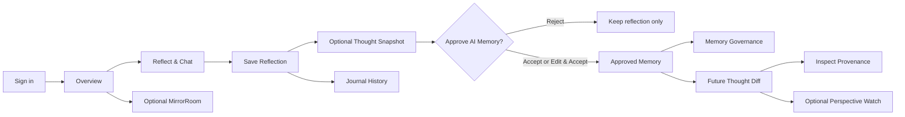
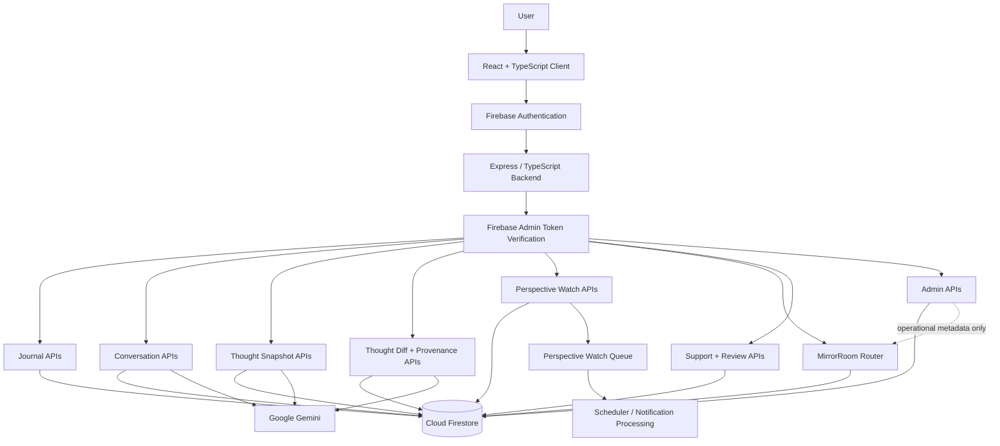
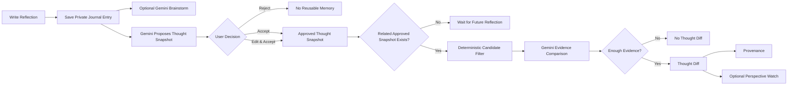
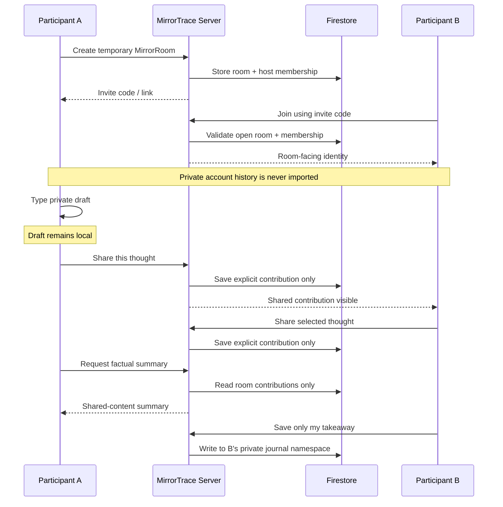

<div align="center">

# MirrorTrace

### Privacy-First AI Reflection, Memory Governance & Collaborative Reasoning

**Think privately. Remember deliberately. Compare perspectives with evidence. Share only what you choose.**

**Gemini · Firebase Authentication · Firestore · React · TypeScript · Express · Vite**

</div>

---

## Product at a Glance

> MirrorTrace is a reflective intelligence platform for people who want AI to help them think without silently taking ownership of their history.

It combines private journaling, Gemini-assisted reflection, consent-governed AI memory, evidence-backed perspective comparison, provenance, scheduled revisits, and selective collaboration.

| Product Principle | MirrorTrace Approach |
|---|---|
| Private reflection | Owner-bound Firebase UID isolation |
| AI memory | User must explicitly approve reusable Thought Snapshots |
| Change over time | Thought Diffs compare approved perspectives |
| Explainability | Provenance answers “Why am I seeing this?” |
| Collaboration | MirrorRoom shares only deliberately submitted room content |
| Administration | Operational visibility without unrestricted journal access |

<!-- =========================================================
SCREENSHOT SLOT 01 — HERO / LANDING PAGE
Paste image at: docs/screenshots/01-landing.png
========================================================= -->

<p align="center">
  
</p>

---

# The Problem

AI assistants and digital journals are increasingly capable of remembering information, but long-term AI memory introduces difficult product and privacy questions.

### 1. AI memory can become invisible

Users may not know what was inferred, what became persistent, how long it is retained, why it is being reused, or how to revoke it.

### 2. Journals preserve entries but not perspective evolution

A conventional journal can show what was written, but it does not naturally answer:

- What did I think about this before?
- Did my position actually change?
- What stayed consistent?
- Which earlier reflections support the comparison?

### 3. Collaboration can destroy privacy boundaries

People may want to compare viewpoints without exposing their complete journals, private AI conversations, reusable memory, old beliefs, or unrelated sensitive reflections.

### 4. Administration can become surveillance

Operational teams need service-health, support, moderation, and audit information. They should not automatically become readers of private reflective content.

MirrorTrace separates **operational visibility** from **content visibility**.

---

# Core Idea

MirrorTrace treats reflective AI as a **consent and provenance problem**, not only a text-generation problem.

The system follows four rules:

1. **Private by default**  
   Reflections belong to one authenticated user.

2. **AI interpretation requires consent**  
   Gemini may propose a Thought Snapshot, but it becomes reusable AI memory only after approval.

3. **Longitudinal claims require evidence**  
   Thought Diffs remain linked to the source reflections and approved snapshots that produced them.

4. **Collaboration is selective**  
   MirrorRoom receives only content participants deliberately share.

---

# Who MirrorTrace Is For

### Students & Early-Career Professionals

Use MirrorTrace to preserve reasoning around internships, higher studies, projects, examinations, career direction, and skill priorities.

**Why it matters:** priorities change quickly, and MirrorTrace can make that evolution visible without turning every temporary thought into permanent AI memory.

### Working Professionals

Use MirrorTrace for role changes, negotiations, mentoring, retrospectives, difficult trade-offs, and career planning.

**Why it matters:** instead of receiving only one-off advice, users retain a traceable history of how a position evolved.

### Founders, Builders & Product Teams

Use MirrorTrace to preserve assumptions about users, product direction, architecture, go-to-market, risk, and prioritization.

**Why it matters:** reasoning can be captured before group discussion, revisited later, and compared against future decisions.

### Knowledge Workers & Leaders

Use MirrorTrace for decision calibration, strategic reflection, assumption tracking, and structured peer discussion.

**Why it matters:** MirrorRoom supports “think privately first, share selectively second.”

---

# How MirrorTrace Differs from a General-Purpose Chatbot

A general-purpose chatbot is optimized to answer a broad range of questions in the moment.

MirrorTrace is optimized around **longitudinal reflective intelligence**:

- the user decides what becomes reusable memory;
- memory can be inspected, exported, retained, or revoked;
- approved perspectives can be compared across time;
- generated comparisons remain evidence-backed through provenance;
- collaboration is separated from private history;
- private reflection and administrative visibility are intentionally separated.

> **ChatGPT helps you think now. MirrorTrace is designed to help you inspect how your thinking changes over time while keeping AI memory under your control.**

---

# Product Experience

## Public Landing Page

The signed-out experience introduces:

- the reflective workflow;
- consent-governed AI memory;
- Thought Snapshots;
- Thought Diffs;
- provenance;
- security boundaries;
- intended audiences;
- public reviews;
- TraceBot;
- Google Sign-In.

<!-- =========================================================
SCREENSHOT SLOT 02 — PUBLIC FEATURES / SECURITY
Paste image at: docs/screenshots/02-public-features.png
========================================================= -->

<p align="center">
  
</p>

---

# Authenticated Navigation

| Page / Control | Purpose |
|---|---|
| **Overview** | Personal reflection dashboard and fast entry point into reflective history. |
| **Reflect & Chat** | Write a reflection or continue with the Gemini reflective companion. |
| **Journal History** | Search, filter, revisit, edit, organize, compare, and review saved reflections. |
| **Memory** | Open the Memory Governance Center for reusable AI memory, Thought Diffs, provenance, Perspective Watches, export, retention, and revocation. |
| **Support** | Submit support text intentionally without automatically exposing journal history. |
| **Feedback** | Submit product feedback or reviews with explicit public-display consent. |
| **MirrorRoom** | Open temporary consent-based collaborative reflection. |
| **Admin Control Room** | Authorized operational administration with privacy-limited visibility. |
| **TraceBot** | Public application guide explaining navigation, features, and privacy. |

---

# Overview

The Overview page is the signed-in home of MirrorTrace.

It provides:

- a concise reflection summary;
- shortcuts into writing and memory workflows;
- high-level reflection metrics;
- perspective-evolution state;
- quick actions.

<!-- =========================================================
SCREENSHOT SLOT 03 — OVERVIEW
Paste image at: docs/screenshots/03-overview.png
========================================================= -->

<p align="center">
  
</p>

---

# Reflect & Chat

## Compose Reflection

The user writes in their own words, optionally adds topic tags, and saves an owner-bound journal entry.

## Reflective Brainstorm Companion

The Gemini-powered companion helps a user:

- clarify a decision;
- untangle uncertainty;
- examine trade-offs;
- explore assumptions;
- continue a multi-turn reflective conversation.

Gemini is used as a thinking companion rather than the final authority over what the user believes.

## Private Session

Private Session is intended for temporary reflection that should not become persistent journal, conversation, Thought Snapshot, Thought Diff, or Perspective Watch data.

<!-- =========================================================
SCREENSHOT SLOT 04 — REFLECT & CHAT
Paste image at: docs/screenshots/04-reflect-chat.png
========================================================= -->

<p align="center">
  
</p>

---

# Consent-Governed AI Memory

## Thought Snapshots

After a saved reflection, Gemini can propose a structured interpretation called a **Thought Snapshot**.

A proposal may include:

- a concise position statement;
- topic;
- tags.

The proposal does not become approved reusable memory until the user chooses to approve it.

The user can:

- **Accept**
- **Edit & Accept**
- **Reject**

Approved memory can participate in later comparison and governance workflows.

---

# Thought Diffs

Thought Diffs compare related approved Thought Snapshots from different moments in time.

A Thought Diff can show:

- Earlier Position
- Current Position
- What Changed
- What Stayed Consistent
- Relationship Assessment

The system is designed to avoid unsupported comparisons and keep valid comparisons traceable.

---

# Provenance

MirrorTrace includes an evidence layer for longitudinal comparison.

Using **Why am I seeing this?** or **Inspect provenance**, the user can inspect safe source evidence behind a Thought Diff.

This helps answer:

- which reflections were used;
- which approved positions were compared;
- what evidence supports the generated comparison.

---

# Perspective Watch

Perspective Watch allows the user to intentionally revisit a perspective later.

A user can choose a future revisit window rather than allowing the system to silently decide what beliefs should be monitored.

Reminder delivery can use safe topic-level context instead of raw journal text.

---

# Journal History

Journal History turns saved reflections into a structured, retrievable personal record.

Implemented tools include:

- search and filtering;
- calendar/list browsing;
- favorites and pinning;
- draft support;
- editing;
- Revisit This;
- Weekly Review;
- Year in Reflection;
- Decision Ledger;
- Reflection Chains;
- Assumption Tracker;
- Version History;
- Knowledge Graph;
- export;
- reminder-oriented workflows.

<!-- =========================================================
SCREENSHOT SLOT 05 — JOURNAL HISTORY
Paste image at: docs/screenshots/05-journal-history.png
========================================================= -->

<p align="center">
  
</p>

---

# Memory Governance Center

Memory Governance is the user's control plane for reusable reflective intelligence.

Users can inspect:

- approved Thought Snapshots;
- retention state;
- Thought Diffs;
- provenance;
- Perspective Watches.

Users can also:

- export governed MirrorTrace memory;
- revoke reusable AI memory;
- inspect reminder-delivery configuration.

> Gemini generating an interpretation is not enough. The user decides whether it becomes reusable memory.

<!-- =========================================================
SCREENSHOT SLOT 06 — MEMORY GOVERNANCE
Paste image at: docs/screenshots/06-memory-governance.png
========================================================= -->

<p align="center">
  
</p>

---

# MirrorRoom

### Consent-Based Collaborative Reflection

**Think privately. Share deliberately. Compare perspectives without surrendering your personal history.**

MirrorRoom is a temporary collaborative reasoning mode. It is intentionally **not a collaborative journal**.

## Capabilities

- create a temporary room;
- random invite code;
- copyable invite link;
- join by invite code;
- named or anonymous participation;
- room prompt;
- explicit **Share this thought** action;
- participant list;
- shared contribution board;
- factual room summary;
- **Save only my takeaway**;
- host-only room closing;
- room expiration;
- server-side membership enforcement.

## Privacy Boundary

Joining a room does not expose:

- journal history;
- Thought Snapshots;
- Thought Diffs;
- provenance;
- Gemini conversation history;
- reusable AI memory;
- saved private takeaways.

Text remains private until **Share this thought** is pressed.

A personal takeaway is written only into the signed-in user's private journal namespace.

<!-- =========================================================
SCREENSHOT SLOT 07 — MIRRORROOM CREATE/JOIN
Paste image at: docs/screenshots/07-mirrorroom.png
========================================================= -->

<p align="center">
  
</p>

<!-- =========================================================
SCREENSHOT SLOT 08 — MIRRORROOM ACTIVE ROOM
Paste image at: docs/screenshots/08-mirrorroom-active.png
========================================================= -->

<p align="center">
  
</p>

---

# Support

The Support page lets a user deliberately submit a support ticket.

The administration layer receives the support text the user intentionally submitted rather than unrestricted private journal access.

<!-- =========================================================
SCREENSHOT SLOT 09 — SUPPORT
Paste image at: docs/screenshots/09-support.png
========================================================= -->

<p align="center">
  
</p>

---

# Feedback & Public Reviews

Users can submit product feedback and reviews.

Public review display is governed by:

- explicit public-display consent;
- moderation state;
- administrator approval.

<!-- =========================================================
SCREENSHOT SLOT 10 — FEEDBACK
Paste image at: docs/screenshots/10-feedback.png
========================================================= -->

<p align="center">
  
</p>

---

# Admin Control Room

The Admin Control Room provides operational administration for authorized administrators.

It includes:

- KPI cards;
- Service Health;
- reflection infrastructure visualization;
- Users table;
- Support Queue;
- Review Moderation;
- Admin Audit Log;
- MirrorRoom operational analytics.

## Admin Privacy Boundary

MirrorRoom analytics can expose operational metadata such as:

- total rooms;
- active and closed state;
- masked creator identity;
- masked participant identities;
- participant roles;
- created timestamps;
- expiry timestamps.

The admin endpoint is designed not to expose:

- room prompts;
- room contribution text;
- factual room summaries;
- private takeaways;
- private journals;
- private Gemini conversations;
- Thought Snapshots;
- Thought Diffs;
- provenance;
- reusable AI memory;
- invite codes.

<!-- =========================================================
SCREENSHOT SLOT 11 — ADMIN HERO / KPIs
Paste image at: docs/screenshots/11-admin-dashboard.png
========================================================= -->

<p align="center">
  
</p>

<!-- =========================================================
SCREENSHOT SLOT 12 — ADMIN MIRRORROOM ANALYTICS
Paste image at: docs/screenshots/12-admin-mirrorroom.png
========================================================= -->

<p align="center">
  
</p>

---

# TraceBot

TraceBot is a fixed public-page application guide.

It explains:

- what MirrorTrace does;
- how the app is different from a general-purpose chatbot;
- where each page is located;
- how Journal History works;
- how AI memory consent works;
- Thought Diffs and provenance;
- Memory Governance;
- Perspective Watch;
- MirrorRoom;
- Support and Feedback;
- the privacy model.

TraceBot is intentionally separate from the private Reflective Brainstorm Companion.

<!-- =========================================================
SCREENSHOT SLOT 13 — TRACEBOT
Paste image at: docs/screenshots/13-tracebot.png
========================================================= -->

<p align="center">
  
</p>

---

# Recommended User Flow



---

# System Architecture



---

# Core Reflection Flow



---

# MirrorRoom Flow



---

# Privacy & Data Isolation Model

Private collections are scoped conceptually under the authenticated Firebase UID:

```text
users/{uid}/journals
users/{uid}/conversations
users/{uid}/thoughtSnapshots
users/{uid}/thoughtDiffs
users/{uid}/provenance
users/{uid}/perspectiveWatches
```

MirrorRoom uses a separate collaboration namespace:

```text
mirrorRooms/{roomId}
mirrorRooms/{roomId}/participants/{participantId}
mirrorRooms/{roomId}/contributions/{contributionId}
```

> Room membership does not grant access to another participant's private `users/{uid}` namespace.

---

# Security Model

- Firebase Authentication identifies the user.
- Protected APIs use server-side authenticated middleware.
- Owner-bound data is scoped under the authenticated UID.
- Frontend admin visibility is not treated as authorization.
- Backend admin role/claim checks remain authoritative.
- Gemini credentials remain server-side.
- AI-generated reusable memory requires consent.
- Thought Diffs maintain provenance.
- MirrorRoom receives only explicitly shared room content.
- Direct client access to collaborative room collections can be denied through Firestore rules.

---

# Gemini Integration

Gemini powers:

- multi-turn Reflective Brainstorm conversations;
- Thought Snapshot proposals;
- evidence-grounded Thought Diff comparisons.

The reflective companion is intended to remain grounded in user-provided context.

Core journal persistence and MirrorRoom collaboration are structurally independent from Gemini generation.

---

# Technology Stack

| Layer | Technology |
|---|---|
| Frontend | React, TypeScript |
| Styling | Tailwind utilities + consolidated MirrorTrace CSS |
| Build | Vite |
| Backend | Express, TypeScript, `tsx` |
| Authentication | Firebase Authentication / Google Sign-In |
| Database | Cloud Firestore |
| Server Firebase Access | Firebase Admin SDK |
| Generative AI | Google Gemini |
| Icons | Lucide React |
| Motion | Motion / React |
| Scheduling | Perspective Watch queue + scheduler endpoint |

---

# Key Backend Services

The Express application exposes or mounts functionality for:

- `/api/health`;
- journal creation, listing, editing, and deletion;
- conversations and messages;
- Thought Snapshot proposal, approval, listing, and deletion;
- Thought Diff generation, listing, and feedback;
- provenance retrieval;
- Perspective Watch scheduling and management;
- memory export;
- notifications;
- email;
- support and reviews;
- journal enhancements;
- admin routes;
- MirrorRoom routes.

The MirrorRoom router must remain mounted before Vite / SPA fallback handling.

---

# Repository Structure

```text
MirrorTrace/
├── server/
│   ├── adminRoutes.ts
│   ├── emailRoutes.ts
│   ├── firebaseAdmin.ts
│   ├── gemini.ts
│   ├── journalEnhancementRoutes.ts
│   ├── notificationRoutes.ts
│   ├── reflectionRoomRoutes.ts
│   ├── supportReviewRoutes.ts
│   └── utils/
│
├── src/
│   ├── components/
│   │   ├── AdminDashboard.tsx
│   │   ├── AdminMirrorRoomsPanel.tsx
│   │   ├── AdminPanelLauncher.tsx
│   │   ├── AuthView.tsx
│   │   ├── BrainstormChat.tsx
│   │   ├── DashboardOverview.tsx
│   │   ├── JournalList.tsx
│   │   ├── MemoryGovernance.tsx
│   │   ├── Navbar.tsx
│   │   ├── ReflectionRoomLauncher.tsx
│   │   └── ...
│   ├── lib/
│   │   ├── api.ts
│   │   ├── firebase.ts
│   │   ├── reflectionRooms.ts
│   │   └── ...
│   ├── styles/
│   │   ├── mirrortrace-app.css
│   │   └── mirrortrace-public.css
│   ├── types/
│   │   └── reflectionRooms.ts
│   ├── App.tsx
│   ├── main.tsx
│   └── index.css
│
├── docs/
│   └── screenshots/
├── firestore.rules
├── server.ts
├── vite.config.ts
├── package.json
└── README.md
```

---

# Local Development

```bash
npm install
npm run dev
```

Default local URL:

```text
http://localhost:3000
```

Health endpoint:

```text
http://localhost:3000/api/health
```

MirrorRoom diagnostic endpoint:

```text
http://localhost:3000/api/mirror-rooms/ping
```

Expected response:

```json
{
  "ok": true,
  "service": "MirrorRoom API",
  "mounted": true
}
```

---

# Build & Verification

```bash
npm run lint
npm run build
```

A successful Vite build should not be treated as a replacement for lint and TypeScript verification.

---

# MirrorRoom Verification Checklist

## Build & Integration

- [ ] `server/reflectionRoomRoutes.ts` exists.
- [ ] `src/lib/reflectionRooms.ts` exists.
- [ ] `src/types/reflectionRooms.ts` exists.
- [ ] `src/components/ReflectionRoomLauncher.tsx` exists.
- [ ] `reflectionRoomRouter` is mounted before Vite fallback handling.
- [ ] `<ReflectionRoomLauncher />` renders only inside the authenticated application.
- [ ] `npm run lint` passes.
- [ ] `npm run build` passes.

## Authentication & Isolation

- [ ] Anonymous users cannot create or join a room.
- [ ] Invalid Firebase tokens receive 401.
- [ ] Authenticated users can create and join valid rooms.
- [ ] Joining a room does not expose journal history.
- [ ] Joining a room does not expose Thought Snapshots.
- [ ] Joining a room does not expose Thought Diffs.
- [ ] Joining a room does not expose provenance.
- [ ] Joining a room does not expose Gemini conversations.
- [ ] Joining a room does not expose reusable AI memory.
- [ ] Local text is not shared until **Share this thought** is pressed.
- [ ] Only explicitly shared contributions appear to participants.
- [ ] Non-members receive 403 for room content.
- [ ] Direct client Firestore access to `mirrorRooms` is denied.
- [ ] Saving a takeaway writes only to the signed-in user's journal.

## Lifecycle

- [ ] Random invite code works.
- [ ] Invite code can be copied.
- [ ] Wrong invite code returns a clear error.
- [ ] Expired room cannot be joined.
- [ ] Closed room cannot be joined.
- [ ] Named and anonymous participation behave correctly.
- [ ] Empty contributions are rejected.
- [ ] Contribution author comes from authenticated membership.
- [ ] Factual summary uses only explicitly shared content.
- [ ] Host can close the room.
- [ ] Non-host cannot close the room.
- [ ] Expiration is enforced server-side.
- [ ] Closed / expired rooms reject new contributions.

---

# Production Readiness Checklist

## Functional

- [ ] Google Sign-In works.
- [ ] Sign-out works.
- [ ] Refresh retains authenticated session.
- [ ] Two accounts can sign in independently.
- [ ] Reflection saves.
- [ ] Gemini multi-turn conversation works.
- [ ] Gemini failure does not lose journal data.
- [ ] History survives sign-out / sign-in.
- [ ] Snapshot proposal remains non-persistent until approval.
- [ ] Accept creates approved reusable memory.
- [ ] Edit & Accept saves edited wording.
- [ ] Reject creates no reusable memory.
- [ ] Thought Diff works for related approved snapshots.
- [ ] Provenance shows correct source records.
- [ ] Memory export works.
- [ ] Memory revoke works.
- [ ] Perspective Watch works.
- [ ] Support submission works.
- [ ] Review moderation and public consent work.

## Security

- [ ] Two-account private-data isolation verified.
- [ ] Normal user cannot access Admin Control Room.
- [ ] Anonymous admin request returns 401 / 403.
- [ ] Normal user receives 403 from admin APIs.
- [ ] Client-side state manipulation does not grant admin.
- [ ] Admin dashboard does not expose private journal/chat/snapshot/diff/provenance content.
- [ ] `.env` is ignored.
- [ ] No service-account JSON is tracked.
- [ ] Gemini key is server-side only.
- [ ] SMTP / scheduler secrets are server-side only.
- [ ] Tokens are not logged.

## UX / Stability

- [ ] 1920×1080 verified.
- [ ] 1366×768 verified.
- [ ] 390px mobile verified.
- [ ] Vertical page scrolling is smooth.
- [ ] Horizontal feature-card browsing works.
- [ ] No accidental page-wide horizontal scrollbar.
- [ ] Navbar works immediately.
- [ ] Loading, empty, retry, and error states work.
- [ ] No application-breaking console errors.
- [ ] Production refresh does not return server 404.

## Production

- [ ] `npm run lint`
- [ ] `npm run build`
- [ ] Firestore rules deployed.
- [ ] Backend deployed.
- [ ] Production Google Sign-In tested.
- [ ] `/api/health` tested.
- [ ] Production secrets injected.
- [ ] Perspective Watch scheduler configured.
- [ ] Production smoke test complete.
- [ ] Walkthrough recorded.

---

# What Makes MirrorTrace Different

### 1. AI Memory Is Explicitly Approved

A Gemini-generated interpretation becomes reusable only after user consent.

### 2. It Models Change Over Time

Thought Snapshots and Thought Diffs turn journaling into longitudinal reflective intelligence.

### 3. AI Claims Have Provenance

“Why am I seeing this?” provides a product-level evidence trail.

### 4. Collaboration Does Not Require Sharing Personal History

MirrorRoom creates a temporary shared reasoning layer over otherwise private user accounts.

### 5. Administration Is Operational, Not Observational

The design distinguishes platform operations from access to reflective content.

### 6. AI Does Not Own the User's Narrative

The user can reject an interpretation, edit it, revoke memory, manage retention, and decide what is shared.

---

# Design Philosophy

> **AI should help people examine their thinking without quietly taking ownership of their history.**

MirrorTrace prioritizes:

- consent over automatic memory;
- provenance over unsupported inference;
- private ownership over default sharing;
- selective collaboration over shared-account access;
- user correction over AI authority.

---

# Current Project Status

MirrorTrace's planned product scope is substantially implemented.

The remaining work before submission should focus on **verification and presentation**, not new core features:

1. complete the production checklist;
2. run clean lint and build;
3. perform the two-account isolation test;
4. test MirrorRoom from two browser profiles or devices;
5. test admin RBAC;
6. verify Firestore rules;
7. verify production deployment and sign-in;
8. remove development backups and duplicate README/checklist files;
9. add the final screenshots in the image slots above;
10. record the submission walkthrough.

---

## Screenshot Folder

Create:

```text
docs/screenshots/
```

Recommended files:

```text
01-landing.png
02-public-features.png
03-overview.png
04-reflect-chat.png
05-journal-history.png
06-memory-governance.png
07-mirrorroom.png
08-mirrorroom-active.png
09-support.png
10-feedback.png
11-admin-dashboard.png
12-admin-mirrorroom.png
13-tracebot.png
```

---

<div align="center">

### MirrorTrace

**Private reflection. Consent-governed memory. Evidence-backed change. Selective collaboration.**

</div>
