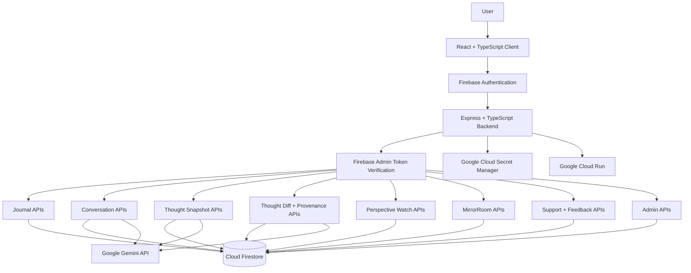
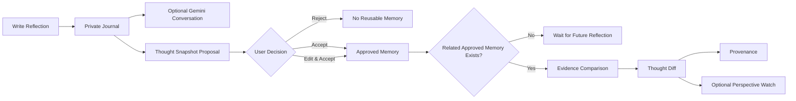
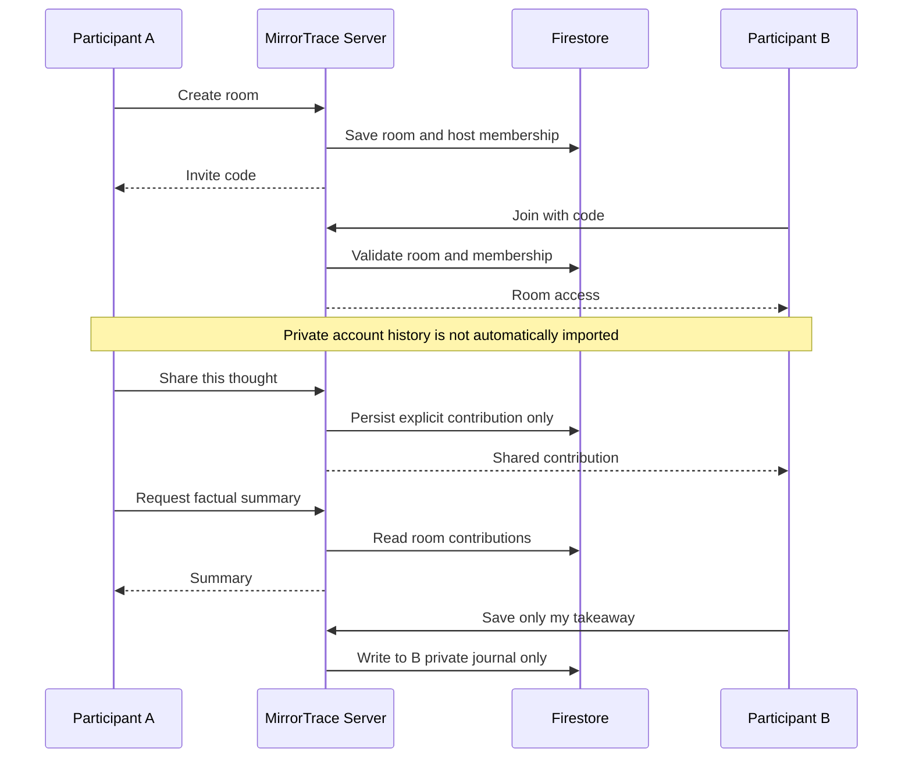

# 🪞 MirrorTrace

### Privacy-First Reflective Intelligence with Consent-Governed AI Memory

**Think privately. Remember deliberately. Compare perspectives with evidence. Share only what you choose.**

[Repository](https://github.com/agcodes0315/Gen-AI-APAC-Ideathon)

**Independently designed and built for the Google Cloud Gen AI Academy — APAC Edition / Cloud Run Build & Deploy Social Challenge.**

---

## 🏆 Challenge Context

MirrorTrace began from the secure **Personal Gemini Journal** challenge baseline built around:

- Firebase Authentication
- Cloud Firestore
- Google Gemini
- Google Cloud Run

The baseline was only the starting point.

MirrorTrace extends it into a broader reflective-intelligence system focused on:

- consent-governed AI memory
- evidence-backed perspective comparison
- provenance
- privacy-preserving collaboration
- user-controlled memory retention
- longitudinal reasoning
- perspective revisits
- operational administration without unrestricted private-content access

The central product principle is:

> **AI can help interpret your thinking, but it should not silently decide what becomes part of your persistent memory.**

---

## 🚀 What MirrorTrace Does

MirrorTrace helps users privately capture thoughts, brainstorm with Gemini, approve reusable AI memory, compare how their thinking changes over time, inspect the evidence behind those comparisons, and selectively collaborate without exposing private journal history.

The product combines:

- private journaling
- multi-turn Gemini reflection
- Thought Snapshot proposals
- explicit memory approval
- Thought Diffs
- provenance
- Perspective Watch
- Memory Governance
- Journal History tools
- MirrorRoom
- Support
- Feedback
- TraceBot
- Admin Control Room

---

## 💡 The Core Idea

Most AI systems are optimized to remember more.

MirrorTrace explores a different question:

> **What if AI could help you remember your thinking without deciding what deserves to be remembered?**

A Gemini-generated interpretation is only a proposal.

```text
AI-generated interpretation
            ≠
Approved reusable memory
```

Only after the user explicitly chooses:

```text
Accept
Edit & Accept
Reject
```

can that interpretation enter reusable AI memory.

---

## 🖥️ Product at a Glance

[MirrorTrace Public Landing Page](https://raw.githubusercontent.com/agcodes0315/Gen-AI-APAC-Ideathon/main/docs/images/Sign%20in%20page.jpeg)


The landing experience introduces MirrorTrace as **evidence-first AI reflection**.

It gives users a direct path into:

- Google Sign-In
- product discovery
- privacy messaging
- TraceBot
- authenticated reflective workflows

MirrorTrace is built around five design principles:

| **Principle** | **MirrorTrace Approach** |
|---|---|
| Private Reflection | Owner-bound Firebase UID isolation |
| AI Memory | Explicit user approval before reuse |
| Perspective Change | Thought Snapshots + Thought Diffs |
| Explainability | Provenance back to source reflections |
| Collaboration | Explicit sharing through MirrorRoom |

---

## 👥 Who MirrorTrace Is For

[MirrorTrace Target Audience](https://raw.githubusercontent.com/agcodes0315/Gen-AI-APAC-Ideathon/main/docs/images/Target%20Audience.jpeg)


MirrorTrace is designed for people who make decisions, revisit ideas, and want to understand how their reasoning changes over time.

### Students & Early-Career Professionals

Useful for:

- careers
- higher studies
- internships
- examinations
- opportunities
- projects
- skill priorities

Example:

A student can compare how their thinking about an MBA, MS, consulting role, or engineering path changes after internships, interviews, and new experiences.

### Working Professionals

Useful for:

- role changes
- negotiations
- difficult trade-offs
- retrospectives
- mentoring
- long-term career planning

Example:

A professional can revisit why they originally wanted to change teams and compare that reasoning with a later perspective.

### Founders & Builders

Useful for preserving:

- product assumptions
- architecture choices
- user hypotheses
- prioritization
- pivots
- risk decisions

### Knowledge Workers & Leaders

Useful for:

- strategic reflection
- hypothesis tracking
- decision calibration
- structured peer reasoning
- assumption review

---

## 🧭 Product Navigation

| **Page** | **Purpose** |
|---|---|
| Overview | Personal reflection dashboard and reflective metrics |
| Reflect & Chat | Private journaling and Gemini brainstorming |
| Journal History | Search, filter, revisit, edit and organize reflections |
| Memory | Memory Governance, approved memories, Thought Diffs and watches |
| Support | Explicit customer-support submission |
| Feedback | Product feedback and optional public-review consent |
| MirrorRoom | Temporary selective collaborative reasoning |
| Admin Control Room | Operational administration for authorized admins |
| TraceBot | Public guide explaining product features and privacy |

---

## 🏠 User Overview

[MirrorTrace User Overview](https://raw.githubusercontent.com/agcodes0315/Gen-AI-APAC-Ideathon/main/docs/images/User%20Overview.jpeg)


The authenticated Overview acts as the user's reflective command center.

It surfaces:

- saved reflection count
- approved Thought Snapshot count
- Thought Diff count
- perspective-evolution state
- shortcuts into reflection
- Memory Governance access
- MirrorRoom access

---

## ⚡ Quick Actions

[MirrorTrace Quick Actions](https://raw.githubusercontent.com/agcodes0315/Gen-AI-APAC-Ideathon/main/docs/images/Quick%20Actions.jpeg)


The Overview provides direct access to the highest-frequency workflows:

```text
Write Reflection
Private Session
Journal History
```

This keeps the primary product actions easy to discover without exposing private content on the public landing page.

---

## ✍️ Reflective Space

[MirrorTrace Reflective Space](https://raw.githubusercontent.com/agcodes0315/Gen-AI-APAC-Ideathon/main/docs/images/User%20Reflective%20Space.jpeg)


The Reflective Space combines private journaling with a Gemini-powered reflective companion.

### Compose Reflection

Users can:

- write a private journal entry
- add topic tags
- save the reflection to Firestore
- later generate a Thought Snapshot

### Reflective Brainstorm Companion

Gemini supports multi-turn reflection around:

- uncertainty
- decisions
- conflicts
- trade-offs
- assumptions
- perspective clarification

The assistant is intentionally framed as a **thinking companion**, not as an authority that decides what the user believes.

### Private Session

Private Session supports reflection without automatically creating persistent journal history or reusable AI memory.

---

## 🧠 Consent-Governed AI Memory

A saved reflection can be evaluated for a structured **Thought Snapshot**.

A Thought Snapshot may contain:

```text
Position Statement
Topic
Tags
Retention Information
```

The user chooses:

```text
┌───────────────┐
│    Accept     │
├───────────────┤
│ Edit & Accept │
├───────────────┤
│    Reject     │
└───────────────┘
```

Only accepted snapshots become reusable AI memory.

The architecture therefore separates:

```text
Gemini Interpretation
        |
        v
User Review
        |
        v
Explicit Consent
        |
        v
Reusable AI Memory
```

No generated interpretation silently becomes persistent memory.

---

## 🔄 Thought Diffs

Thought Diffs compare related approved Thought Snapshots from different moments in time.

A Thought Diff can surface:

- earlier position
- later position
- apparent shift
- apparent continuity
- relationship assessment
- provenance

The system does not compare snapshots blindly.

Candidate matching evaluates topic and tag relationships before Gemini determines whether enough evidence exists for a meaningful comparison.

Think of the feature as:

> **Version control for human thinking.**

```text
What did I believe before?
          |
          v
What do I believe now?
          |
          v
What changed?
          |
          v
What stayed consistent?
          |
          v
What evidence supports the comparison?
```

---

## 🔎 Provenance

Every meaningful Thought Diff should be inspectable.

MirrorTrace connects comparisons back to source evidence through provenance records.

These can contain:

- earlier snapshot
- later snapshot
- earlier journal
- later journal
- timestamps
- source excerpts
- source positions

Controls such as:

```text
Why am I seeing this?
Inspect Provenance
```

allow users to understand why an AI-generated comparison exists.

This makes longitudinal AI reasoning **traceable rather than opaque**.

---

## 📚 Journal History

[MirrorTrace Journal History](https://raw.githubusercontent.com/agcodes0315/Gen-AI-APAC-Ideathon/main/docs/images/User%20Journal%20History.jpeg)


Journal History turns private entries into a structured personal reasoning record.

Available workflows include:

- Search
- Tag filtering
- Date filtering
- Calendar browsing
- Favorites
- Editing
- Revisit This
- Weekly Review
- Decision Ledger
- Reflection Chains
- Assumption Tracker
- Version History
- Knowledge Graph
- Export
- Reminder-oriented workflows

---

## 📊 Year in Reflection

[MirrorTrace Year in Reflection](https://raw.githubusercontent.com/agcodes0315/Gen-AI-APAC-Ideathon/main/docs/images/Reflection%20Wrap.jpeg)


Year in Reflection summarizes factual information already present in the user's saved reflective data.

It can surface:

- reflection count
- approved memories
- Thought Diffs
- most active month
- revisited topics

The feature is deliberately framed as a **factual reflection summary**, not a psychological or mood-inference system.

---

## 🛡️ Memory Governance Center

[MirrorTrace Memory Governance Center](https://raw.githubusercontent.com/agcodes0315/Gen-AI-APAC-Ideathon/main/docs/images/User%20Memory%20Governance.jpeg)


Memory Governance is the control plane for everything MirrorTrace is allowed to reuse as reflective intelligence.

Users can inspect and manage:

- approved memories
- memory-retention state
- expiring memories
- Thought Diffs
- provenance
- Perspective Watches
- reminder delivery
- memory export
- memory revocation

The user remains the authority over reusable memory.

---

## 👁️ Perspective Watch

Perspective Watch allows users to intentionally schedule a future revisit.

MirrorTrace does not silently decide which belief deserves continued monitoring.

The user chooses:

```text
What to Watch
      +
When to Revisit It
      +
Whether Reminders Are Enabled
```

Perspective Watch therefore remains user-initiated rather than AI-imposed.

---

## 👥 MirrorRoom

[MirrorTrace MirrorRoom](https://raw.githubusercontent.com/agcodes0315/Gen-AI-APAC-Ideathon/main/docs/images/MirrorRoom%20.jpeg)


### Think privately. Share deliberately.

MirrorRoom is a temporary collaborative reasoning environment.

It is **not a shared journal**.

Capabilities include:

- create a temporary room
- join using an invite code
- copy invite links
- choose display-name behavior
- explicitly share a thought
- view participants
- generate a factual room summary
- save only your own takeaway
- host-only closing
- room expiry
- server-side membership validation

### Privacy Boundary

MirrorRoom does not automatically import:

```text
Private Journal Entries
Thought Snapshots
Thought Diffs
Provenance
Private Gemini Conversations
Reusable AI Memory
Saved Private Takeaways
```

Only text deliberately submitted through the room contribution flow enters collaborative scope.

The design is:

```text
Private Thought
      |
      v
Explicit "Share This Thought"
      |
      v
MirrorRoom Contribution
```

not:

```text
Private History
      |
      v
Automatic Room Exposure
```

---

## 🧑‍💻 Admin Control Room

[MirrorTrace Admin Control Room](https://raw.githubusercontent.com/agcodes0315/Gen-AI-APAC-Ideathon/main/docs/images/Admin%20Dashboard.jpeg)


The Admin Control Room provides operational visibility while maintaining an explicit privacy boundary.

It can surface aggregate information such as:

- registered users
- Thought Snapshot counts
- Thought Diff counts
- active watches
- push devices
- authorization state
- privacy-boundary state

The administrator is not automatically granted unrestricted journal visibility.

---

## 🩺 Service Health & Aggregate Activity

[MirrorTrace Admin Service Health](https://raw.githubusercontent.com/agcodes0315/Gen-AI-APAC-Ideathon/main/docs/images/Admin%20Dashboard%202.jpeg)


The operations dashboard can verify:

- Firebase Authentication
- Cloud Firestore
- Gemini configuration
- SMTP configuration
- FCM configuration
- scheduler configuration
- aggregate reflection infrastructure
- minimized account metadata

This provides operational insight without turning administration into private-content surveillance.

---

## 🆘 Support & Feedback

MirrorTrace includes user-facing support and feedback workflows.

### Customer Support

Users explicitly submit the information they want administrators to receive.

Private journal history is not automatically attached to support requests.

### Feedback & Public Reviews

Public review display is designed around:

- explicit public-display consent
- moderation status
- admin approval

This prevents private reflective information from being silently repurposed as public product content.

---

## 🤖 TraceBot

TraceBot is the public application guide.

It explains:

- what MirrorTrace does
- navigation
- Thought Snapshots
- Thought Diffs
- provenance
- Memory Governance
- Perspective Watch
- MirrorRoom
- Support
- Feedback
- the privacy model

TraceBot is separate from the authenticated Reflective Brainstorm Companion.

---

## 🔐 Security & Privacy Architecture

MirrorTrace is designed around explicit trust boundaries.

| **Security Concern** | **MirrorTrace Approach** |
|---|---|
| User Identity | Firebase Authentication |
| Backend Identity Verification | Firebase Admin token verification |
| User Data Isolation | Owner-bound `users/{uid}/...` Firestore paths |
| Gemini Credentials | Server-side only |
| AI Memory | Explicit Accept / Edit & Accept |
| Thought Diff Evidence | Provenance records |
| Admin Access | Server-side authorization |
| Collaboration | MirrorRoom membership validation |
| Shared Content | Explicit contribution only |
| Client Data Access | Firestore rules + backend boundaries |

---

## 🔒 Firestore Isolation

Private reflective records are stored under owner-bound paths.

```text
users/{uid}/journals
users/{uid}/conversations
users/{uid}/thoughtSnapshots
users/{uid}/thoughtDiffs
users/{uid}/provenance
users/{uid}/perspectiveWatches
```

MirrorRoom data lives in a separate collaborative namespace.

The privacy model is therefore:

```text
Authenticated User
      |
      v
Verified Firebase UID
      |
      v
users/{uid}/...
```

rather than trusting a user ID supplied by the browser.

---

## 🏗️ Architecture



---

## 🔄 Reflection Lifecycle



---

## 👥 MirrorRoom Lifecycle



---

## ☁️ Google Cloud & Gemini

| **Service** | **MirrorTrace Use** |
|---|---|
| Firebase Authentication | Google Sign-In and authenticated identity |
| Cloud Firestore | Journals, conversations, memories, diffs, provenance, watches, rooms, support and feedback |
| Gemini API | Reflective conversation, Thought Snapshot generation and Thought Diff evaluation |
| Firebase Admin SDK | Server-side token verification and privileged backend operations |
| Google Cloud Secret Manager | Secure production Gemini credential storage |
| Google Cloud Run | Production deployment |

---

## ⚙️ Key Engineering Decisions

| **Engineering Challenge** | **MirrorTrace Approach** |
|---|---|
| AI should not silently define user memory | Explicit snapshot approval |
| Memory should remain inspectable | Memory Governance Center |
| Perspective comparisons need evidence | Thought Diff provenance |
| Private journals should not leak into collaboration | Separate MirrorRoom namespace |
| Admins need visibility without surveillance | Aggregate operations dashboard |
| User data must remain isolated | UID-scoped Firestore architecture |
| Gemini secrets must not reach the browser | Server-side Gemini API proxy |
| Invalid API routes should not return SPA HTML | Explicit `/api` 404 fallback |
| Production deployment should be testable | Health, predeploy and smoke tests |

---

## 🛠️ Tech Stack

| **Layer** | **Technology** |
|---|---|
| Frontend | React, TypeScript |
| Build | Vite |
| Styling | Tailwind utilities + custom MirrorTrace CSS |
| Backend | Express, TypeScript, tsx |
| Authentication | Firebase Authentication |
| Database | Cloud Firestore |
| Server Firebase | Firebase Admin SDK |
| Generative AI | Google Gemini |
| Deployment | Google Cloud Run |
| Secrets | Google Cloud Secret Manager |
| Icons | Lucide React |

---

## 📡 API Surface

| **Method** | **Endpoint** | **Purpose** |
|---|---|---|
| `GET` | `/api/health` | Backend health check |
| `POST` | `/api/journal` | Save reflection |
| `GET` | `/api/journal` | List user reflections |
| `DELETE` | `/api/journal/:id` | Delete reflection and dependent records |
| `POST` | `/api/conversations` | Create reflective conversation |
| `GET` | `/api/conversations` | List conversations |
| `GET` | `/api/conversations/:id/messages` | Fetch conversation messages |
| `POST` | `/api/conversations/:id/messages` | Multi-turn Gemini message |
| `POST` | `/api/thought-snapshots/propose` | Generate non-persistent snapshot proposal |
| `POST` | `/api/thought-snapshots/approve` | Persist approved user memory |
| `GET` | `/api/thought-snapshots` | List approved memories |
| `DELETE` | `/api/thought-snapshots/:id` | Remove approved snapshot |
| `POST` | `/api/thought-diffs/generate` | Evaluate related approved snapshots |
| `GET` | `/api/thought-diffs` | List Thought Diffs |
| `GET` | `/api/thought-diffs/:id/provenance` | Inspect comparison provenance |
| `POST` | `/api/thought-diffs/:id/feedback` | Update comparison feedback |
| `POST` | `/api/perspective-watches` | Schedule perspective revisit |
| `GET` | `/api/perspective-watches` | List perspective watches |
| `PATCH` | `/api/perspective-watches/:id` | Complete or dismiss watch |
| `GET` | `/api/memory/export` | Export user-governed memory |
| `GET` | `/api/mirror-rooms/ping` | MirrorRoom service health |

Unknown `/api/*` routes return a JSON `404` rather than falling through to the React SPA.

---

## 📁 Repository Structure

```text
Gen-AI-APAC-Ideathon/
│
├── docs/
│   └── images/
│       ├── Admin Dashboard.jpeg
│       ├── Admin Dashboard 2.jpeg
│       ├── MirrorRoom .jpeg
│       ├── Quick Actions.jpeg
│       ├── Reflection Wrap.jpeg
│       ├── Sign in page.jpeg
│       ├── Target Audience.jpeg
│       ├── User Journal History.jpeg
│       ├── User Memory Governance.jpeg
│       ├── User Overview.jpeg
│       └── User Reflective Space.jpeg
│
├── public/
│
├── server/
│   ├── adminRoutes.ts
│   ├── emailRoutes.ts
│   ├── firebaseAdmin.ts
│   ├── gemini.ts
│   ├── journalEnhancementRoutes.ts
│   ├── notificationRoutes.ts
│   ├── reflectionRoomRoutes.ts
│   └── supportReviewRoutes.ts
│
├── src/
│   ├── components/
│   ├── hooks/
│   ├── lib/
│   ├── styles/
│   │   ├── mirrortrace-app.css
│   │   └── mirrortrace-public.css
│   ├── App.tsx
│   └── main.tsx
│
├── scripts/
│   ├── predeployCheck.ts
│   ├── productionVerify.ts
│   ├── releaseGate.ps1
│   ├── setAdminRole.ts
│   └── smokeTest.ts
│
├── firestore.rules
├── server.ts
├── vite.config.ts
├── package.json
└── README.md
```

---

## ⚙️ Running Locally

### Requirements

```text
Node.js
npm
Firebase project configuration
Gemini API credential
```

### 1. Clone

```bash
git clone https://github.com/agcodes0315/Gen-AI-APAC-Ideathon.git
cd Gen-AI-APAC-Ideathon
```

### 2. Install Dependencies

```bash
npm install
```

### 3. Configure Environment

Use:

```text
.env.example
```

as the reference for required Firebase and server configuration.

Never commit:

```text
.env
service-account JSON
private credentials
Gemini API keys
```

### 4. Run

```bash
npm run dev
```

Open:

```text
http://localhost:3000
```

---

## 🧪 Production Verification

Run:

```bash
npm run lint
```

Then:

```bash
npm run build
```

Then:

```bash
npx tsx ./scripts/predeployCheck.ts
```

With the application running:

```bash
npx tsx ./scripts/smokeTest.ts
```

The smoke test validates:

```text
/api/health
Landing Page
Favicon
Anonymous Admin Protection
Unknown API 404 Handling
```

---

## 🔐 Production Secret Management

Gemini credentials must remain server-side.

A production Secret Manager setup can use:

```bash
gcloud secrets create GEMINI_API_KEY \
  --replication-policy="automatic"
```

Add the secret value:

```bash
echo -n "YOUR_API_KEY" | \
gcloud secrets versions add GEMINI_API_KEY \
  --data-file=-
```

Grant the Cloud Run runtime service account access:

```bash
gcloud secrets add-iam-policy-binding GEMINI_API_KEY \
  --member="serviceAccount:YOUR_RUNTIME_SERVICE_ACCOUNT" \
  --role="roles/secretmanager.secretAccessor"
```

Then bind the secret to the Cloud Run revision.

**Before final challenge submission, verify the deployed Cloud Run revision is actually using Secret Manager.**

---

## ☁️ Deployment

MirrorTrace is designed for deployment on **Google Cloud Run**.

The backend already supports Cloud Run's dynamic `PORT` environment variable and binds to:

```text
0.0.0.0
```

After deployment, apply the challenge label:

```bash
gcloud run services update YOUR_SERVICE_NAME \
  --region=YOUR_REGION \
  --update-labels=dev-tutorial=cloud-run-ai-challenge
```

Verify:

```bash
gcloud run services describe YOUR_SERVICE_NAME \
  --region=YOUR_REGION \
  --format="value(metadata.labels)"
```

---

## 🌐 Live Demo

The final Google Cloud Run deployment URL will be added here after production deployment verification.

---

## ✅ Submission Readiness

### Functional

- [ ] Google Sign-In works in production
- [ ] Session survives refresh
- [ ] Reflection saves and reloads
- [ ] Gemini multi-turn conversation works
- [ ] Thought Snapshot proposal appears
- [ ] Reject creates no reusable memory
- [ ] Accept creates approved memory
- [ ] Edit & Accept persists the edited version
- [ ] Related approved snapshots produce a Thought Diff
- [ ] Provenance opens
- [ ] Perspective Watch works
- [ ] Journal search works
- [ ] Journal date filters work
- [ ] Calendar view works
- [ ] Memory export works
- [ ] MirrorRoom works with two accounts
- [ ] Admin Control Room works
- [ ] Support works
- [ ] Feedback works
- [ ] TraceBot works

### Security

- [ ] User A cannot see User B private data
- [ ] Anonymous protected API access fails
- [ ] Normal users cannot access admin APIs
- [ ] Admin authorization is enforced server-side
- [ ] MirrorRoom membership is enforced server-side
- [ ] MirrorRoom does not import private journal history
- [ ] `.env` is ignored by Git
- [ ] No service-account JSON is committed
- [ ] Gemini key is absent from frontend source
- [ ] Firestore rules are deployed
- [ ] Secret Manager binding is verified

### Stability

- [x] `npm run lint` passes
- [x] `npm run build` passes
- [x] `predeployCheck.ts` passes
- [x] `smokeTest.ts` passes
- [ ] Production Cloud Run journey verified

### Challenge Verification

- [ ] Cloud Run service is publicly reachable
- [ ] Required challenge label is present
- [ ] GitHub repository is public
- [ ] README images render correctly
- [ ] Social post contains `#AccelerateAIwithCloudRun`
- [ ] Every submitted URL opens in an incognito browser

---

## 🎯 What Makes MirrorTrace Different

### 1. AI Memory Requires Explicit Consent

Gemini-generated interpretations do not silently become reusable memory.

### 2. It Models Perspective Change Over Time

Thought Snapshots and Thought Diffs create a longitudinal reasoning layer.

### 3. AI Comparisons Are Evidence-Backed

Provenance connects generated comparisons back to approved source evidence.

### 4. Collaboration Is Selective by Design

MirrorRoom creates a temporary reasoning layer without importing private journal history.

### 5. Administration Is Separated from Private Reflection

Operational visibility does not automatically imply private-content visibility.

### 6. The User Remains the Authority

Users can:

```text
Reject
Edit
Accept
Retain
Export
Revoke
```

their reusable AI memory.

---

## 📊 What This Project Demonstrates

MirrorTrace brings together:

- full-stack TypeScript engineering
- React application architecture
- Firebase Authentication
- Cloud Firestore data modeling
- Gemini integration
- consent-aware AI memory
- provenance
- explainable AI
- longitudinal reasoning
- privacy boundaries
- collaborative workflows
- server-side authorization
- operational administration
- Cloud Run deployment
- production verification

---

## 🌱 Production Roadmap

```text
Phase 1 — Current Submission
├── Consent-governed reflective AI
├── Thought Snapshots
├── Thought Diffs
├── Provenance
├── MirrorRoom
├── Perspective Watch
└── Memory Governance

Phase 2 — Memory Intelligence
├── Semantic retrieval across approved memory
├── Richer retention controls
└── Cross-topic reasoning summaries

Phase 3 — Team & Organization
├── Organization-level RBAC
├── Shared governed workspaces
└── Expanded moderation and audit telemetry

Phase 4 — Production Scale
├── Cloud Scheduler / Tasks
├── Structured observability
├── Accessibility audits
└── Advanced export / portability
```

---

## ⚠️ Scope

MirrorTrace is a reflective-intelligence application.

It is **not** a:

```text
Medical System
Psychological Diagnostic System
Therapeutic System
Clinical Decision System
```

Its purpose is to help users articulate, revisit, and compare their own reasoning while keeping them in control of reusable AI memory.

---

## 👩‍💻 Author

### Agrima Saxena

**Solo Developer · Full-Stack Engineering · AI/ML · Cloud · Security**

[GitHub](https://github.com/agcodes0315)

[MirrorTrace Repository](https://github.com/agcodes0315/Gen-AI-APAC-Ideathon)

Built independently for the **Google Cloud Gen AI Academy — APAC Edition / Cloud Run Build & Deploy Social Challenge**.

---

### MirrorTrace is not trying to remember everything.

## It is trying to remember only what the user deliberately permits.

**Private reflection · Consent-governed memory · Evidence-backed change · Selective collaboration**

⭐ **If you find MirrorTrace interesting, consider starring the repository.**